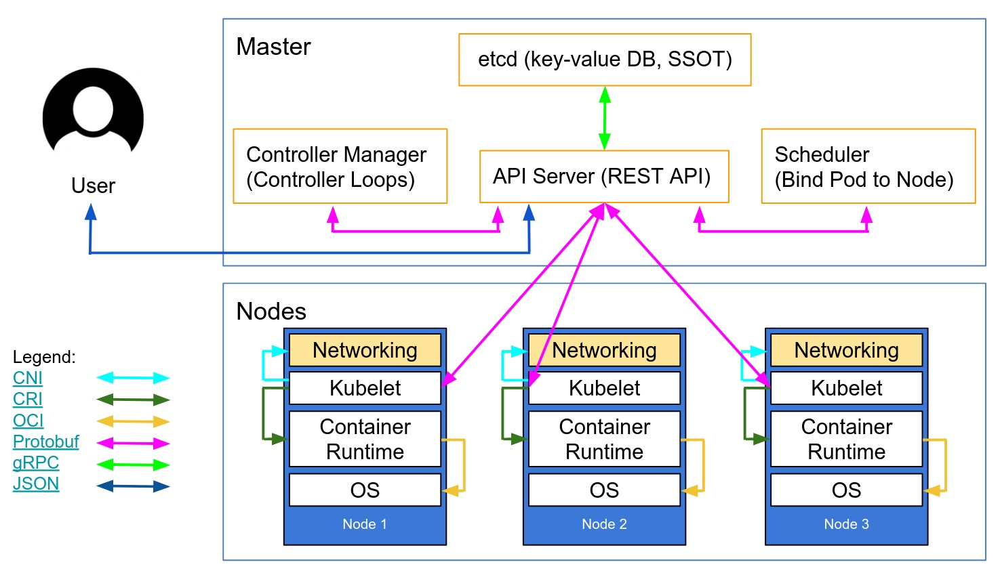

# Kubernates安装

## 环境准备

​	Kubernetes架构图如下所示：

|    角色    |       IP        |
| :--------: | :-------------: |
| k8s-master | 192.168.159.143 |
| k8s-node1  | 192.168.159.144 |
| k8s-node2  | 192.168.159.145 |

## centos7

### 步骤

1. [环境准备](./pre-request)
2. 集群安装
   - 使用[kubeadm](./kubeadm)进行安装
   - [二进制安装](./binary)
   - [使用kubez-ansible工具安装](https://github.com/gopixiu-io/kubez-ansible)

## Ubuntu

### 步骤

1. [使用源码编译安装单节点k8s集群](./ubuntu)

