# Ingress：集群进出流量的总管

## 为什么要有 Ingress

​	通过上次课程的讲解，我们知道了 Service 的功能和运行机制，它本质上就是一个由 kube-proxy 控制的四层负载均衡，在 TCP/IP 协议栈上转发流量（Service 工作原理示意图）：

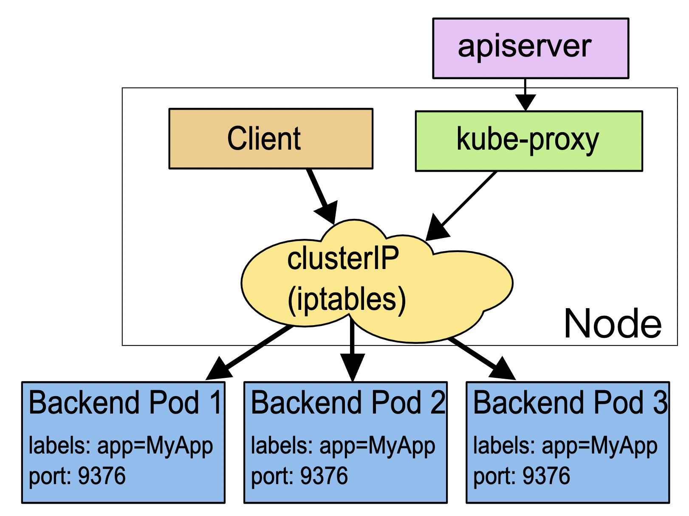

​	但在四层上的负载均衡功能还是太有限了，只能够依据 IP 地址和端口号做一些简单的判断和组合，而我们现在的绝大多数应用都是跑在七层的 HTTP/HTTPS 协议上的，有更多的高级路由条件，比如主机名、URI、请求头、证书等等，而这些在 TCP/IP 网络栈里是根本看不见的。

​	Service 还有一个缺点，它比较适合代理集群内部的服务。如果想要把服务暴露到集群外部，就只能使用 NodePort 或者 LoadBalancer 这两种方式，而它们都缺乏足够的灵活性，难以管控，这就导致了一种很无奈的局面：我们的服务空有一身本领，却没有合适的机会走出去大展拳脚。该怎么解决这个问题呢？

​	Kubernetes 还是沿用了 Service 的思路，既然 Service 是四层的负载均衡，那么我再引入一个新的 API 对象，在七层上做负载均衡是不是就可以了呢？

​	**不过除了七层负载均衡，这个对象还应该承担更多的职责，也就是作为流量的总入口，统管集群的进出口数据，**“扇入”“扇出”流量（也就是我们常说的“南北向”），让外部用户能够安全、顺畅、便捷地访问内部服务：

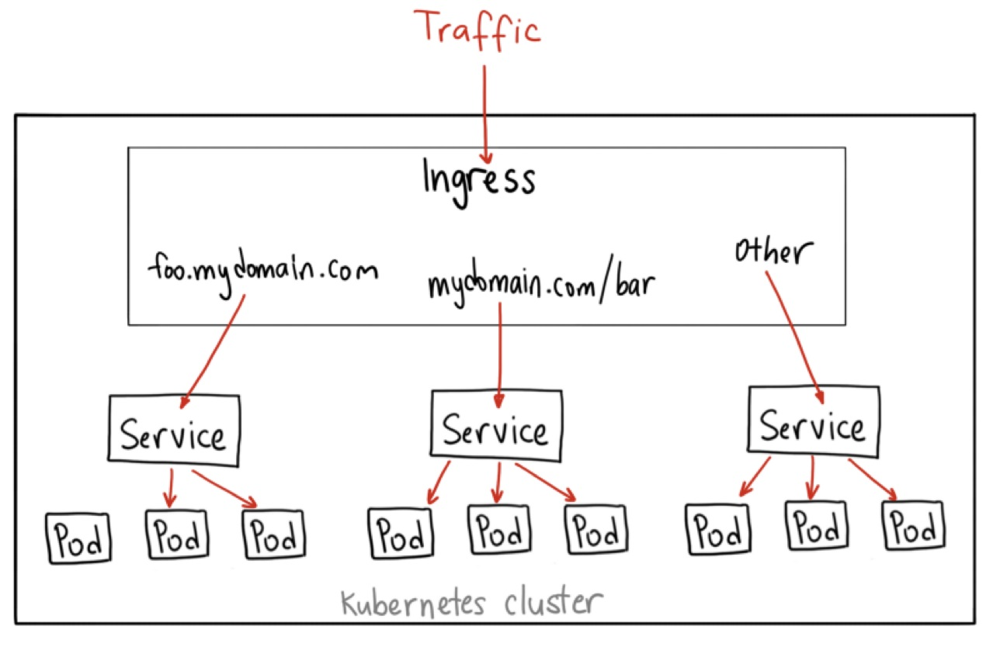

​	所以，这个 API 对象就顺理成章地被命名为 Ingress，意思就是集群内外边界上的入口。

## 为什么要有 Ingress Controller

​	再对比一下 Service 我们就能更透彻地理解 Ingress。Ingress 可以说是在七层上另一种形式的 Service，它同样会代理一些后端的 Pod，也有一些路由规则来定义流量应该如何分配、转发，只不过这些规则都使用的是 HTTP/HTTPS 协议。

​	你应该知道，Service 本身是没有服务能力的，它只是一些 iptables 规则，**真正配置、应用这些规则的实际上是节点里的 kube-proxy 组件**。如果没有 kube-proxy，Service 定义得再完善也没有用。同样的，Ingress 也只是一些 HTTP 路由规则的集合，相当于一份静态的描述文件，真正要把这些规则在集群里实施运行，还需要有另外一个东西，这就是 Ingress Controller，它的作用就相当于 Service 的 kube-proxy，能够读取、应用 Ingress 规则，处理、调度流量。

​	按理来说，Kubernetes 应该把 Ingress Controller 内置实现，作为基础设施的一部分，就像 kube-proxy 一样。**不过 Ingress Controller 要做的事情太多，与上层业务联系太密切，所以 Kubernetes 把 Ingress Controller 的实现交给了社区**，任何人都可以开发 Ingress Controller，只要遵守 Ingress 规则就好。这就造成了 Ingress Controller“百花齐放”的盛况。

​	由于 Ingress Controller 把守了集群流量的关键入口，掌握了它就拥有了控制集群应用的“话语权”，所以众多公司纷纷入场，精心打造自己的 Ingress Controller，意图在 Kubernetes 流量进出管理这个领域占有一席之地。

​	这些实现中最著名的，就是老牌的反向代理和负载均衡软件 Nginx 了。从 Ingress Controller 的描述上我们也可以看到，HTTP 层面的流量管理、安全控制等功能其实就是经典的反向代理，而 Nginx 则是其中稳定性最好、性能最高的产品，所以它也理所当然成为了 Kubernetes 里应用得最广泛的 Ingress Controller。

​	不过，因为 Nginx 是开源的，谁都可以基于源码做二次开发，所以它又有很多的变种，比如社区的 [Kubernetes Ingress Controlle](https://github.com/kubernetes/ingress-nginx)、Nginx 公司自己的 [Nginx Ingress Controller](https://github.com/nginxinc/kubernetes-ingress)、还有基于 OpenResty 的 [Kong Ingress Controller](https://github.com/Kong/kubernetes-ingress-controller)等等。根据 Docker Hub 上的统计，**Nginx 公司的开发实现是下载量最多的 Ingress Controller**，所以我将以它为例，讲解 Ingress 和 Ingress Controller 的用法。

​	下面的这张图就来自 Nginx 官网，比较清楚地展示了 Ingress Controller 在 Kubernetes 集群里的地位：

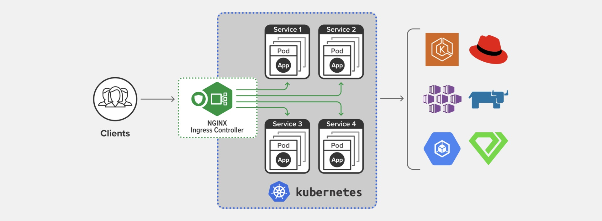


## 为什么要有 IngressClass

​	那么到现在，有了 Ingress 和 Ingress Controller，我们是不是就可以完美地管理集群的进出流量了呢？最初 Kubernetes 也是这么想的，一个集群里有一个 Ingress Controller，再给它配上许多不同的 Ingress 规则，应该就可以解决请求的路由和分发问题了。但随着 Ingress 在实践中的大量应用，很多用户发现这种用法会带来一些问题，比如：

- 由于某些原因，项目组需要引入不同的 Ingress Controller，但 Kubernetes 不允许这样做；
- Ingress 规则太多，都交给一个 Ingress Controller 处理会让它不堪重负；
- 多个 Ingress 对象没有很好的逻辑分组方式，管理和维护成本很高；
- 集群里有不同的租户，他们对 Ingress 的需求差异很大甚至有冲突，无法部署在同一个 Ingress Controller 上。

​	所以，Kubernetes 就又提出了一个 Ingress Class 的概念，让它插在 Ingress 和 Ingress Controller 中间，作为流量规则和控制器的协调人，解除了 Ingress 和 Ingress Controller 的强绑定关系。

​	现在，**Kubernetes 用户可以转向管理 Ingress Class，用它来定义不同的业务逻辑分组，简化 Ingress 规则的复杂度**。比如说，我们可以用 Class A 处理博客流量、Class B 处理短视频流量、Class C 处理购物流量。

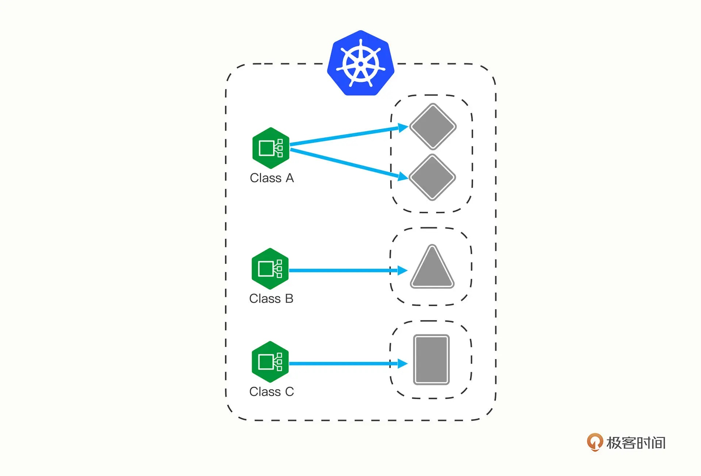

​	这些 Ingress 和 Ingress Controller 彼此独立，不会发生冲突，所以上面的那些问题也就随着 Ingress Class 的引入迎刃而解了。

## 如何使用 YAML 描述 Ingress/Ingress Class

​	我们花了比较多的篇幅学习 Ingress、 Ingress Controller、Ingress Class 这三个对象，全是理论，你可能觉得学得有点累。但这也是没办法的事情，毕竟现实的业务就是这么复杂，而且这个设计架构也是社区经过长期讨论后达成的一致结论，是我们目前能获得的最佳解决方案。好，了解了这三个概念之后，我们就可以来看看如何为它们编写 YAML 描述文件了。和之前学习 Deployment、Service 对象一样，首先应当用命令 `kubectl api-resources` 查看它们的基本信息，输出列在这里了：

```shell
$ kubectl api-resources

NAME          SHORTNAMES   APIVERSION           NAMESPACED   KIND
ingresses       ing          networking.k8s.io/v1   true         Ingress
ingressclasses               networking.k8s.io/v1   false        IngressClass
```

​	你可以看到，Ingress 和 Ingress Class 的 apiVersion 都是“networking.k8s.io/v1”，而且 Ingress 有一个简写“ing”，但 Ingress Controller 怎么找不到呢？这是因为 Ingress Controller 和其他两个对象不太一样，它不只是描述文件，是一个要实际干活、处理流量的应用程序，而应用程序在 Kubernetes 里早就有对象来管理了，那就是 Deployment 和 DaemonSet，所以我们只需要再学习 Ingress 和 Ingress Class 的的用法就可以了。先看 Ingress。Ingress 也是可以使用 kubectl create 来创建样板文件的，和 Service 类似，它也需要用两个附加参数：

- --class，指定 Ingress 从属的 Ingress Class 对象。
- --rule，指定路由规则，基本形式是“URI=Service”，也就是说是访问 HTTP 路径就转发到对应的 Service 对象，再由 Service 对象转发给后端的 Pod。

​	好，现在我们就执行命令，看看 Ingress 到底长什么样：

```shell
$ export out="--dry-run=client -o yaml"
$ kubectl create ing ngx-ing --rule="ngx.test/=ngx-svc:80" --class=ngx-ink $out
```

```yaml
apiVersion: networking.k8s.io/v1
kind: Ingress
metadata:
  name: ngx-ing
spec:
  ingressClassName: ngx-ink
  rules:
  - host: ngx.test
    http:
      paths:
      - path: /
        pathType: Exact
        backend:
          service:
            name: ngx-svc
            port:
              number: 80
```

​	在这份 Ingress 的 YAML 里，有两个关键字段：`ingressClassName`和`rules`，分别对应了命令行参数，含义还是比较好理解的。

​	只是`rules`的格式比较复杂，嵌套层次很深。不过仔细点看就会发现它是把路由规则拆散了，有 host 和 http path，在 path 里又指定了路径的匹配方式，可以是精确匹配（Exact）或者是前缀匹配（Prefix），再用 backend 来指定转发的目标 Service 对象。

​	**不过我个人觉得，Ingress YAML 里的描述还不如 kubectl create 命令行里的 --rule 参数来得直观易懂，而且 YAML 里的字段太多也很容易弄错，建议你还是让 kubectl 来自动生成规则，然后再略作修改比较好。**

​	有了 Ingress 对象，那么与它关联的 Ingress Class 是什么样的呢？其实 Ingress Class 本身并没有什么实际的功能，**只是起到联系 Ingress 和 Ingress Controller 的作用**，所以它的定义非常简单，在`spec`里只有一个必需的字段“controller”，表示要使用哪个 Ingress Controller，具体的名字就要看实现文档了。比如，如果我要用 Nginx 开发的 Ingress Controller，那么就要用名字“nginx.org/ingress-controller”：

```
apiVersion: networking.k8s.io/v1
kind: IngressClass
metadata:
  name: ngx-ink

spec:
  controller: nginx.org/ingress-controller
```

​	Ingress 和 Service、Ingress Class 的关系我也画成了一张图，方便你参考：

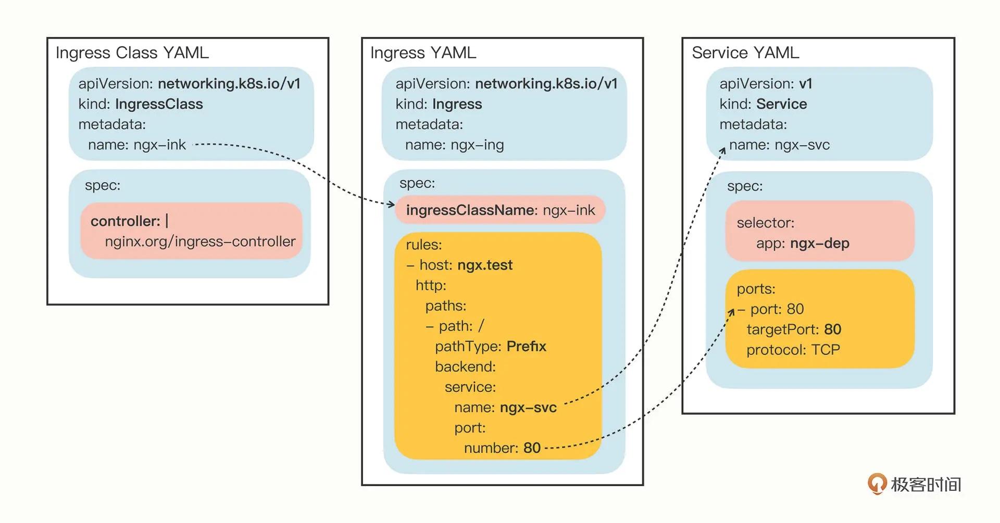

## 如何在 Kubernetes 里使用 Ingress/Ingress Class

​	因为 Ingress Class 很小，所以我把它与 Ingress 合成了一个 YAML 文件，让我们用 `kubectl apply` 创建这两个对象：

```shell
$ kubectl apply -f ingress.yml
```

​	然后我们用 `kubectl get` 来查看对象的状态：

```shell
kubectl get ingressclass
kubectl get ing
```

​	命令 `kubectl describe` 可以看到更详细的 Ingress 信息：

```shell
$ kubectl describe ing ngx-ing
```

​	可以看到，Ingress 对象的路由规则 Host/Path 就是在 YAML 里设置的域名“ngx.test/”，而且已经关联了 Service 对象，还有 Service 后面的两个 Pod。

​	另外，不要对 Ingress 里“Default backend"的错误提示感到惊讶，在找不到路由的时候，它被设计用来提供一个默认的后端服务，但不设置也不会有什么问题，所以大多数时候我们都忽略它。

## 如何在 Kubernetes 里使用 Ingress Controller

​	准备好了 Ingress 和 Ingress Class，接下来我们就需要部署真正处理路由规则的 Ingress Controller。

​	你可以在 GitHub 上找到 [Nginx Ingress Controller 的项目](https://github.com/nginxinc/kubernetes-ingress)，因为它以 Pod 的形式运行在 Kubernetes 里，所以同时支持 Deployment 和 DaemonSet 两种部署方式。这里我选择的是 Deployment，相关的 YAML 也都在[这里](./ingress)。

​	Nginx Ingress Controller 的安装略微麻烦一些，有很多个 YAML 需要执行，但如果只是做简单的试验，就只需要执行一个setup脚本文件（具体内容可详见setup.sh）：

```shell
$ ./ingress/setup.sh
```

​	前两条命令为 Ingress Controller 创建了一个独立的名字空间“nginx-ingress”，还有相应的账号和权限，这是为了访问 apiserver 获取 Service、Endpoint 信息用的；后两条则是创建了一个 ConfigMap 和 Secret，用来配置 HTTP/HTTPS 服务。部署 Ingress Controller 不需要我们自己从头编写 Deployment，Nginx 已经为我们提供了示例 YAML，但创建之前为了适配我们自己的应用还必须要做几处小改动：

- metadata 里的 name 要改成自己的名字，比如 ngx-kic-dep。
- spec.selector 和 template.metadata.labels 也要修改成自己的名字，比如还是用 ngx-kic-dep。
- containers.image 可以改用 apline 版本，加快下载速度，比如 nginx/nginx-ingress:2.2-alpine。
- 最下面的 args 要加上 -ingress-class=ngx-ink，也就是前面创建的 Ingress Class 的名字，这是让 Ingress Controller 管理 Ingress 的关键。

修改完之后，Ingress Controller 的 YAML 大概是这个样子：

```yaml
apiVersion: apps/v1
kind: Deployment
metadata:
  name: ngx-kic-dep
  namespace: nginx-ingress

spec:
  replicas: 1
  selector:
    matchLabels:
      app: ngx-kic-dep

  template:
    metadata:
      labels:
        app: ngx-kic-dep
    ...
    spec:
      containers:
      - image: nginx/nginx-ingress:2.2-alpine
        ...
        args:
          - -ingress-class=ngx-ink
```

​	有了 Ingress Controller，这些 API 对象的关联就更复杂了，你可以用下面的这张图来看出它们是如何使用对象名字联系起来的：

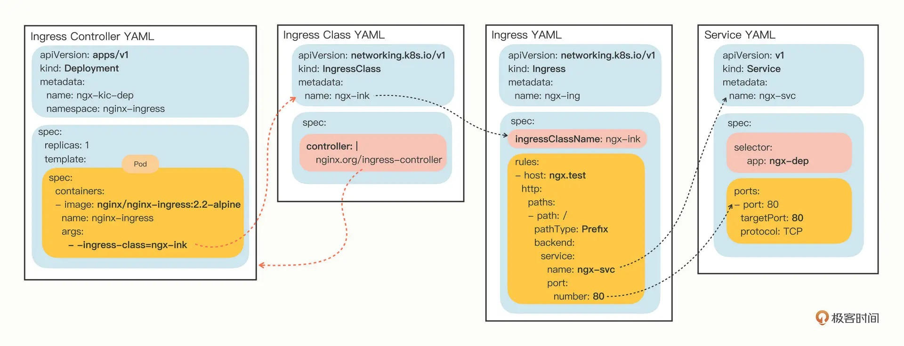

​	确认 Ingress Controller 的 YAML 修改完毕之后，就可以用 `kubectl apply` 创建对象：

```shell
$ kubectl apply -f kic.yml
```

​	注意 Ingress Controller 位于名字空间“nginx-ingress”，所以查看状态需要用“-n”参数显式指定，否则我们只能看到“default”名字空间里的 Pod：

```shell
$ kubectl get deploy -n nginx-ingress
$ kubectl get pod -n nginx-ingress
```

​	现在 Ingress Controller 就算是运行起来了。不过还有最后一道工序，因为 Ingress Controller 本身也是一个 Pod，想要向外提供服务还是要依赖于 Service 对象。所以你至少还要再为它定义一个 Service，使用 NodePort 或者 LoadBalancer 暴露端口，才能真正把集群的内外流量打通。这个工作就交给你课下自己去完成了。这里，我就用前面提到的命令`kubectl port-forward`，它可以直接把本地的端口映射到 Kubernetes 集群的某个 Pod 里，在测试验证的时候非常方便。下面这条命令就把本地的 8080 端口映射到了 Ingress Controller Pod 的 80 端口：

```shell
$ kubectl port-forward -n nginx-ingress ngx-kic-dep-8859b7b86-cplgp 8080:80 &
```

​	我们在 curl 发测试请求的时候需要注意，因为 Ingress 的路由规则是 HTTP 协议，所以就不能用 IP 地址的方式访问，必须要用域名、URI。你可以修改 /etc/hosts 来手工添加域名解析，也可以使用 --resolve 参数，指定域名的解析规则，比如在这里我就把“ngx.test”强制解析到“127.0.0.1”，也就是被 `kubectl port-forward` 转发的本地地址：

```shell
$ curl --resolve ngx.test:8080:127.0.0.1 http://ngx.test:8080
```

​	把这个访问结果和上一节课里的 Service 对比一下，你会发现最终效果是一样的，都是把请求转发到了集群内部的 Pod，但 Ingress 的路由规则不再是 IP 地址，而是 HTTP 协议里的域名、URI 等要素。

## 小结

​	好了，今天就讲到这里，我们学习了 Kubernetes 里七层的反向代理和负载均衡对象，包括 Ingress、Ingress Controller、Ingress Class，它们联合起来管理了集群的进出流量，是集群入口的总管。小结一下今天的主要内容：

1. Service 是四层负载均衡，能力有限，所以就出现了 Ingress，它基于 HTTP/HTTPS 协议定义路由规则。
2. Ingress 只是规则的集合，自身不具备流量管理能力，需要 Ingress Controller 应用 Ingress 规则才能真正发挥作用。
3. Ingress Class 解耦了 Ingress 和 Ingress Controller，我们应当使用 Ingress Class 来管理 Ingress 资源。
4. 最流行的 Ingress Controller 是 Nginx Ingress Controller，它基于经典反向代理软件 Nginx。

​	再补充一点，目前的 Kubernetes 流量管理功能主要集中在 Ingress Controller 上，已经远不止于管理“入口流量”了，它还能管理“出口流量”，也就是 egress，甚至还可以管理集群内部服务之间的“东西向流量”。此外，Ingress Controller 通常还有很多的其他功能，比如 TLS 终止、网络应用防火墙、限流限速、流量拆分、身份认证、访问控制等等，完全可以认为它是一个全功能的反向代理或者网关，感兴趣的话你可以找找这方面的资料。


## 认识Kong Ingress Controller

​	我们已经见过了 Nginx 官方开发的 Nginx Ingress Controller，但它局限于 Nginx 自身的能力，Ingress、Service 等对象更新时必须要修改静态的配置文件，再重启进程（reload），在变动频繁的微服务系统里就会引发一些问题。而今天要说的 Kong Ingress Controller，则是站在了 Nginx 这个巨人的肩膀之上，基于 OpenResty 和内嵌的 LuaJIT 环境，实现了完全动态的路由变更，消除了 reload 的成本，运行更加平稳，而且还有很多额外的增强功能，非常适合那些对 Kubernetes 集群流量有更高、更细致管理需求的用户（图片来源 Kong 官网）。

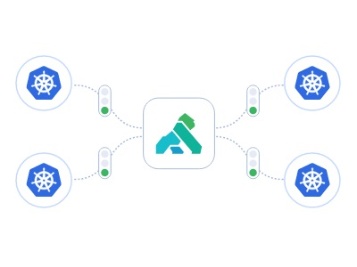


### 安装 Kong Ingress Controller

​	接下来我们就来看看如何在 Kubernetes 集群里引入 Kong Ingress Controller。

​	简单起见，这次我选择了 minikube 环境，版本还是 1.25.2，对应的 Kubernetes 也是之前的 1.23.3：

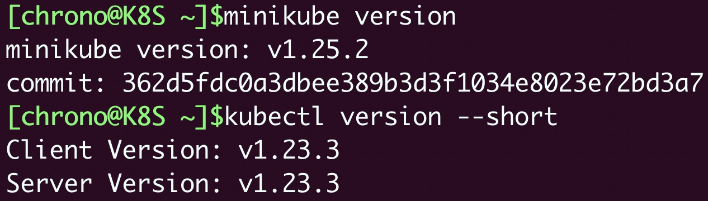

​	目前 [Kong Ingress Controller](https://github.com/Kong/kubernetes-ingress-controller) 的最新版本是 2.7.0。

```shell
wget https://github.com/Kong/kubernetes-ingress-controller/archive/refs/tags/v2.7.0.tar.gz
```

​	Kong Ingress Controller 安装所需的 YAML 文件，都存放在解压缩后的“deploy”目录里，提供“有数据库”和“无数据库”两种部署方式，这里我选择了最简单的“无数据库”方式，只需要一个 all-in-one-dbless.yaml 就可以完成部署工作，也就是执行这条 `kubectl apply` 命令：

```shell
kubectl apply -f all-in-one-dbless.yaml
```

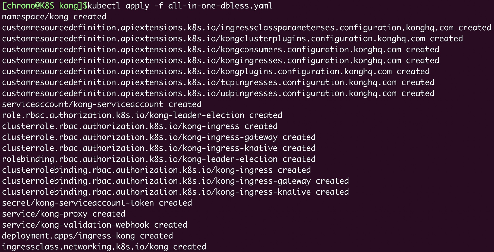

​	我们可以再对比一下两种 Ingress Controller 的安装方式。Nginx Ingress Controller 是由多个分散的 YAML 文件组成的，需要顺序执行多次 kubectl apply 命令，有点麻烦；而 Kong Ingress Controller 则把 Namespace、RBAC、Secret、CRD 等对象都合并在了一个文件里，安装很方便，同时也不会发生遗忘创建资源的错误。安装之后，Kong Ingress Controller 会创建一个新的名字空间“kong”，里面有一个默认的 Ingress Controller，还有对应的 Service，你可以用 `kubectl get` 来查看：

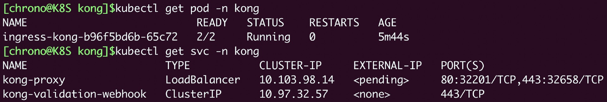

​	看这里的截图，你可能会注意到，在 `kubectl get pod` 输出的“READY”列里显示的是“2/2”，意思是**这个 Pod 里有两个容器**。这也是 Kong Ingress Controller 与 Nginx Ingress Controller 在实现架构方面的一个明显不同点。Kong Ingress Controller，在 Pod 里使用两个容器，**分别运行管理进程 Controller 和代理进程 Proxy**，两个容器之间使用环回地址（Loopback）通信；而 Nginx Ingress Controller 则是因为要修改静态的 Nginx 配置文件，所以管理进程和代理进程必须在一个容器里（图片表示 Kong 架构设计）。

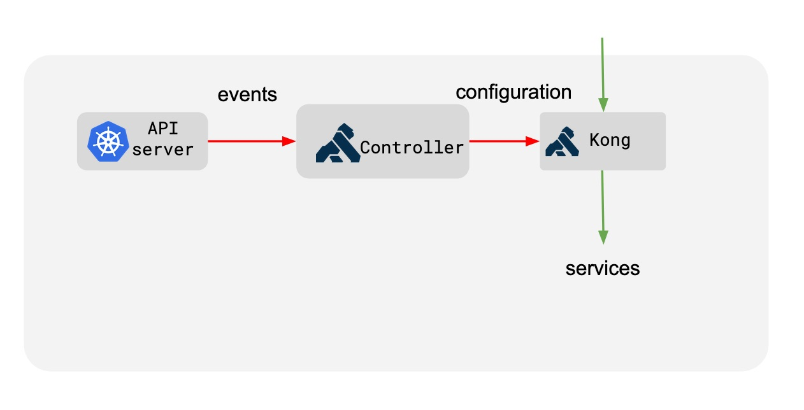

​	两种方式并没有优劣之分，但 Kong Ingress Controller 分离的好处是两个容器彼此独立，可以各自升级维护，对运维更友好一点。Kong Ingress Controller 还创建了两个 Service 对象，其中的“kong-proxy”是转发流量的服务，注意它被定义成了“LoadBalancer”类型，显然是为了在生产环境里对外暴露服务，不过在我们的实验环境（无论是 minikube 还是 kubeadm）中只能使用 NodePort 的形式，这里可以看到 80 端口被映射到了节点的 32201。现在让我们尝试访问一下 Kong Ingress Controller，IP 就用 worker 节点的地址，如果你和我一样用的是 minikube，则可以用 $(minikube ip) 的形式简单获取：

```shell
curl $(minikube ip):32201 -i
```

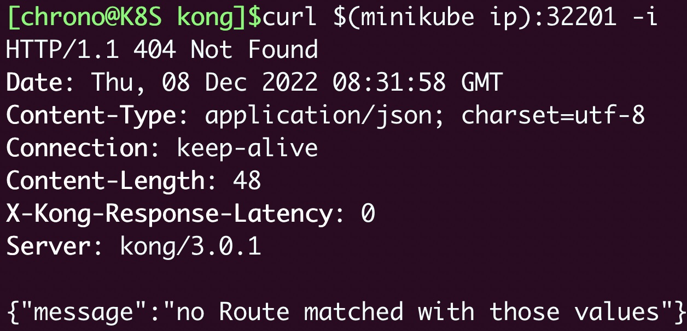

​	从 curl 获取的响应结果可以看到， Kong Ingress Controller 2.7 内部使用的 Kong 版本是 3.0.1，因为现在我们没有为它配置任何 Ingress 资源，所以返回了状态码 404，这是正常的。我们还可以用 `kubectl exec` 命令进入 Pod，查看它的内部信息：

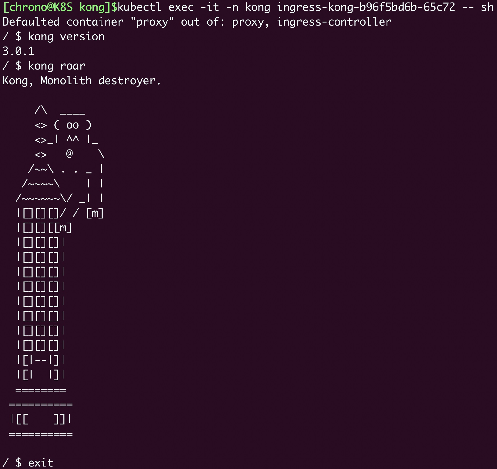

​	虽然 Kong Ingress Controller 里有两个容器，但我们不需要特意用 -c 选项指定容器，它会自动进入默认的 Proxy 容器（另一个 Controller 容器里因为不包含 Shell，也是无法进入查看的）。

### 使用 Kong Ingress Controller

​	安装好了，我们看如何使用。和前面讲的一样，我们仍然不使用默认的 Ingress Controller，而是利用 Ingress Class 自己创建一个新的实例，这样能够更好地理解掌握 Kong Ingress Controller 的用法。

​	首先，定义后端应用，还是用 Nginx 来模拟，用 ConfigMap 定义配置文件再加载进 Nginx Pod 里，然后部署 Deployment 和 Service，比较简单，你也比较熟悉，就不列出 YAML 代码了，只看一下运行命令后的截图：

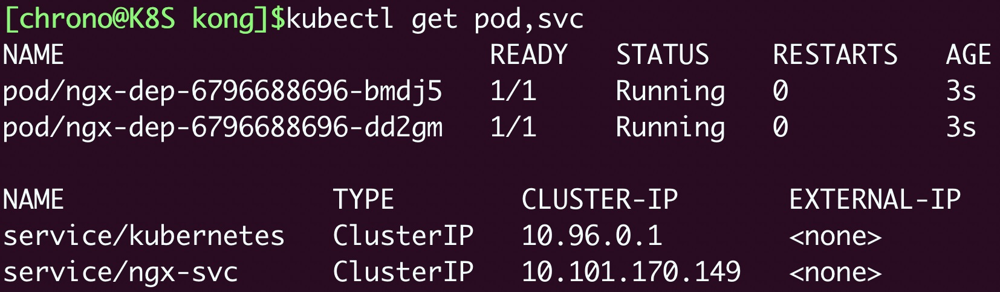

​	显示我创建了两个 Nginx Pod，Service 对象的名字是 ngx-svc。

​	接下来是定义 Ingress Class，名字是“kong-ink”， “spec.controller”字段的值是 Kong Ingress Controller 的名字“ingress-controllers.konghq.com/kong”：

```yaml
apiVersion: networking.k8s.io/v1
kind: IngressClass
metadata:
  name: kong-ink
spec:
  controller: ingress-controllers.konghq.com/kong
```

​	然后就是定义 Ingress 对象了，我们还是可以用 `kubectl create` 来生成 YAML 样板文件，用 --rule 指定路由规则，用 --class 指定 Ingress Class：

```shell
kubectl create ing kong-ing --rule="kong.test/=ngx-svc:80" --class=kong-ink $out
```

​	生成的 Ingress 对象大概就是下面这样，域名是“kong.test”，流量会转发到后端的 ngx-svc 服务：

```yaml
apiVersion: networking.k8s.io/v1
kind: Ingress
metadata:
  name: kong-ing
spec:
  ingressClassName: kong-ink
  rules:
  - host: kong.test
    http:
      paths:
      - path: /
        pathType: Prefix
        backend:
          service:
            name: ngx-svc
            port:
              number: 80
```

​	最后，我们要从 all-in-one-dbless.yaml 这个文件中分离出 Ingress Controller 的定义。其实也很简单，只要搜索“Deployment”就可以了，然后把它以及相关的 Service 代码复制一份，另存成“kic.yml”。

​	当然了，刚复制的代码和默认的 Kong Ingress Controller 是完全相同的，所以我们必须要参考帮助文档做一些修改，要点我列在了这里：

- Deployment、Service 里 metadata 的 name 都要重命名，比如改成 ingress-kong-dep、ingress-kong-svc。
- spec.selector 和 template.metadata.labels 也要修改成自己的名字，一般来说和 Deployment 的名字一样，也就是 ingress-kong-dep。
- 第一个容器是流量代理 Proxy，它里面的镜像可以根据需要，改成任意支持的版本，比如 Kong:2.7、Kong:2.8 或者 Kong:3.1。
- 第二个容器是规则管理 Controller，要用环境变量“CONTROLLER_INGRESS_CLASS”指定新的 Ingress Class 名字 kong-ink，同时用“CONTROLLER_PUBLISH_SERVICE”指定 Service 的名字 ingress-kong-svc。
- Service 对象可以把类型改成 NodePort，方便后续的测试。改了这些之后，一个新的 Kong Ingress Controller 就完成了，大概是这样，修改点我也加注释了你可以对照着看：

```yaml
apiVersion: apps/v1
kind: Deployment
metadata:
  name: ingress-kong-dep            # 重命名
  namespace: kong
spec:
  replicas: 1
  selector:
    matchLabels:
      app: ingress-kong-dep        # 重命名
  template:
    metadata:
      labels:
        app: ingress-kong-dep        # 重命名
    spec:
      containers:
      - env:                       # 第一个容器， Proxy
        ...
        image: kong:3.1            # 改镜像

      - env:                       # 第二个容器，Controller
        - name: CONTROLLER_INGRESS_CLASS
          value: kong-ink                  # 改Ingress Class
        - name: CONTROLLER_PUBLISH_SERVICE
          value: kong/ingress-kong-svc     # 改Service
        ...
---

apiVersion: v1
kind: Service
metadata:
  name: ingress-kong-svc          # 重命名
  namespace: kong
spec:
  ...
  selector:
    app: ingress-kong-dep         # 重命名
  type: NodePort                  # 改类型 
```

在[这里](./kong)，你也可以直接找到改好的 YAML 文件。把这些都准备好，我们就可以来测试验证 Kong Ingress Controller 了：

```shell
kubectl apply -f ngx-deploy.yml
kubectl apply -f ingress.yml
kubectl apply -f kic.yml
```

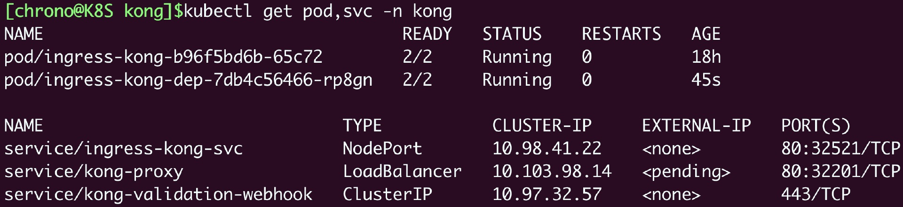

​	这个截图显示了这些对象的创建结果，其中，新 Service 对象的 NodePort 端口是 32521。

​	下面我们就来用 curl 发送 HTTP 请求，注意，应该用“--resolve”或者“-H”参数指定 Ingress 里定义的域名“kong.test”，否则 Kong Ingress Controller 会找不到路由：

```shell
curl $(minikube ip):32521 -H 'host: kong.test' -v
```

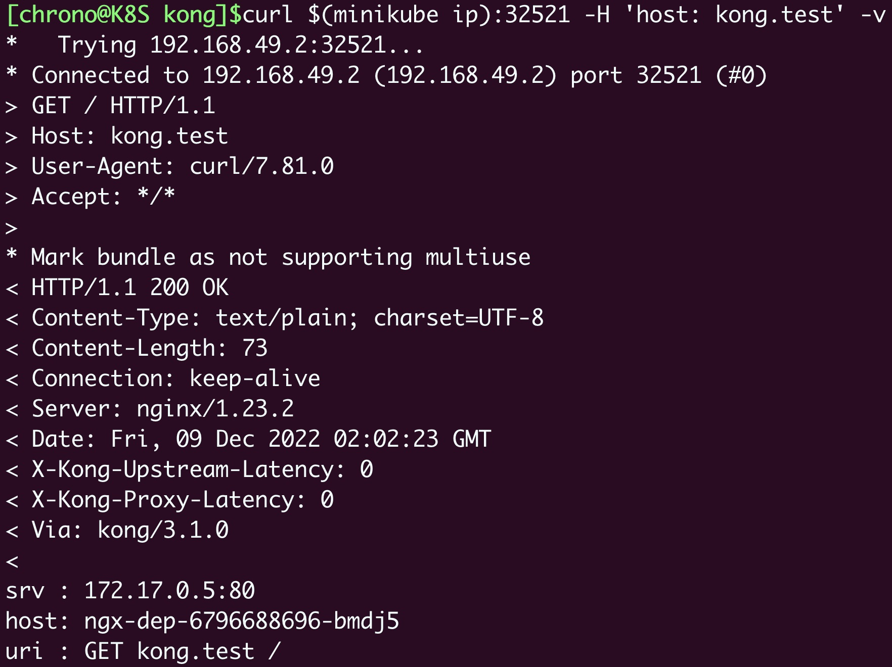

​	你可以看到，Kong Ingress Controller 正确应用了 Ingress 路由规则，返回了后端 Nginx 应用的响应数据，而且从响应头“Via”里还可以发现，它现在用的是 Kong 3.1。

### 扩展 Kong Ingress Controller

​	到这里，Kong Ingress Controller 的基本用法你就掌握了。

​	不过，只使用 Kubernetes 标准的 Ingress 资源来管理流量，是无法发挥出 Kong Ingress Controller 的真正实力的，它还有很多非常好用、非常实用的增强功能。

​	我们知道k8s里的annotation，它是 Kubernetes 为资源对象提供的一个方便扩展功能的手段，所以，**使用 annotation 就可以在不修改 Ingress 自身定义的前提下，让 Kong Ingress Controller 更好地利用内部的 Kong 来管理流量**。

​	目前 Kong Ingress Controller 支持在 Ingress 和 Service 这两个对象上添加 annotation，相关的详细文档可以[参考官网](https://docs.konghq.com/kubernetes-ingress-controller/2.7.x/references/annotations/)，这里我只介绍两个 annotation。

​	第一个是“konghq.com/host-aliases”，它可以为 Ingress 规则添加额外的域名。

​	你应该知道吧，Ingress 的域名里可以使用通配符 *，比如 *.abc.com，但问题在于 * 只能是前缀，不能是后缀，也就是说我们无法写出 abc.* 这样的域名，这在管理多个域名的时候就显得有点麻烦。

​	有了“konghq.com/host-aliases”，我们就可以用它来“绕过”这个限制，让 Ingress 轻松匹配有不同后缀的域名。

​	比如，我修改一下 Ingress 定义，在“metadata”里添加一个 annotation，让它除了“kong.test”，还能够支持“kong.dev”“kong.ops”等域名，就是这样：

```yaml
apiVersion: networking.k8s.io/v1
kind: Ingress
metadata:
  name: kong-ing
  annotations:
    konghq.com/host-aliases: "kong.dev, kong.ops"  #注意这里
spec:
  ...
```

​	使用 kubectl apply 更新 Ingress，再用 curl 来测试一下：

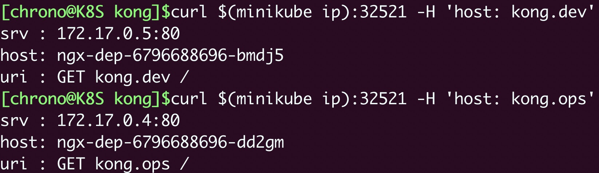

​	你就会发现 Ingress 已经支持了这几个新域名。

​	第二个是“**konghq.com/plugins**”，它可以启用 Kong Ingress Controller 内置的各种插件（Plugins）。

​	插件，是 Kong Ingress Controller 的一个特色功能，你可以理解成是“预制工件”，能够附加在流量转发的过程中，实现各种数据处理，并且这个插件机制是开放的，我们既可以使用官方插件，也可以使用第三方插件，还可以使用 Lua、Go 等语言编写符合自己特定需求的插件。

​	Kong 公司维护了一个经过认证的[插件中心](https://docs.konghq.com/hub/)，你可以在这里找到涉及认证、安全、流控、分析、日志等多个领域大约 100 多个插件，今天我们看两个常用的 Response Transformer、Rate Limiting。

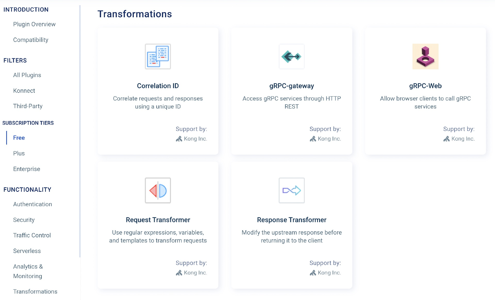

​	Response Transformer 插件实现了对响应数据的修改，能够添加、替换、删除响应头或者响应体；Rate Limiting 插件就是限速，能够以时分秒等单位任意限制客户端访问的次数。

​	定义插件需要使用 CRD 资源，名字是“KongPlugin”，你也可以用kubectl api-resources、kubectl explain 等命令来查看它的 apiVersion、kind 等信息：

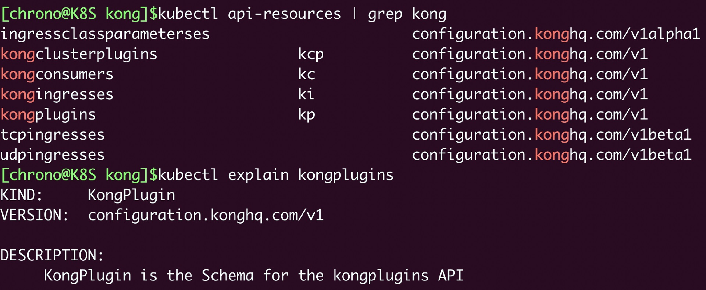

​	下面我就给出这两个插件对象的示例定义：

```yaml
apiVersion: configuration.konghq.com/v1
kind: KongPlugin
metadata:
  name: kong-add-resp-header-plugin

plugin: response-transformer
config:
  add:
    headers:
    - Resp-New-Header:kong-kic

---

apiVersion: configuration.konghq.com/v1
kind: KongPlugin
metadata:
  name: kong-rate-limiting-plugin

plugin: rate-limiting
config:
  minute: 2
```

​	KongPlugin 对象，因为是自定义资源，所以和标准 Kubernetes 对象不一样，不使用“spec”字段，而是用“**plugin**”来指定插件名，用“**config**”来指定插件的配置参数。

​	比如在这里，我就让 Response Transformer 插件添加一个新的响应头字段，让 Rate Limiting 插件限制客户端每分钟只能发两个请求。

​	定义好这两个插件之后，我们就可以在 Ingress 对象里用 annotations 来启用插件功能了：

```yaml
apiVersion: networking.k8s.io/v1
kind: Ingress
metadata:
  name: kong-ing
  annotations:
    konghq.com/plugins: |
        kong-add-resp-header-plugin,
        kong-rate-limiting-plugin
```

​	现在让我们应用这些插件对象，并且更新 Ingress：

```shell
kubectl apply -f crd.yml
```

​	再发送 curl 请求：

```shell
curl $(minikube ip):32521 -H 'host: kong.test' -i
```

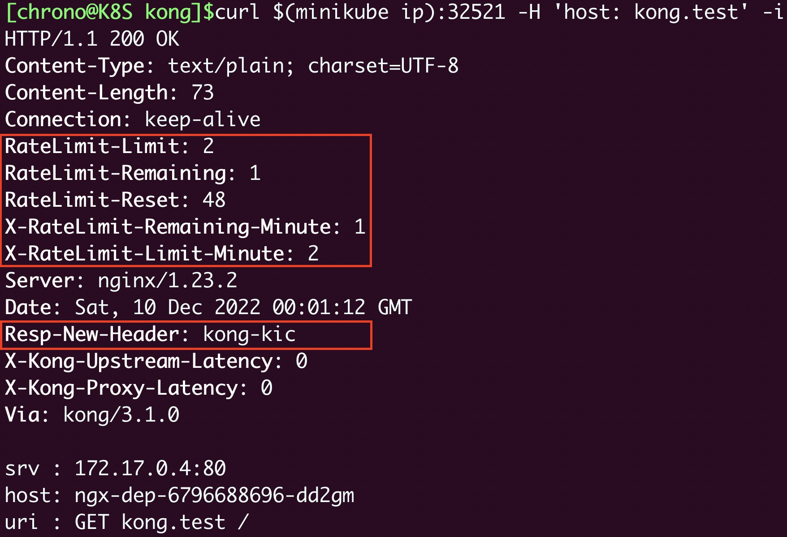

​	你就会发现响应头里多出了几个字段，其中的 RateLimit-* 是限速信息，而 Resp-New-Header 就是新加的响应头字段。把 curl 连续执行几次，就可以看到限速插件生效了：

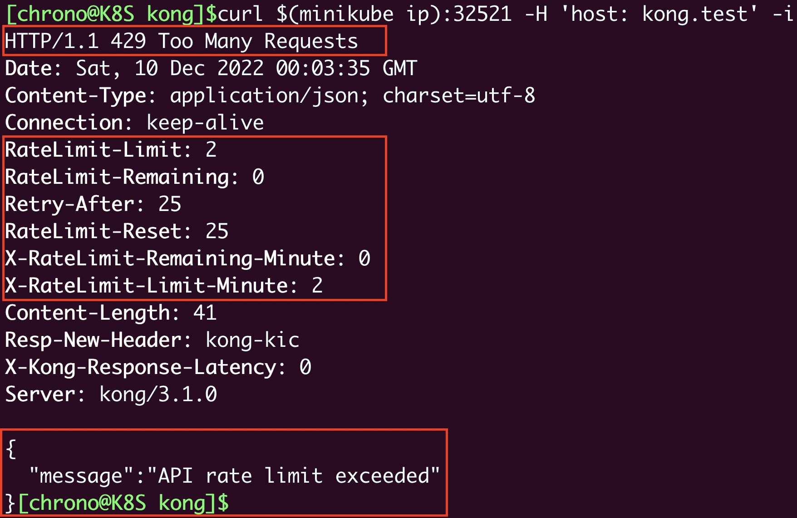

​	Kong Ingress Controller 会返回 429 错误，告诉你访问受限，而且会用“Retry-After”等字段来告诉你多少秒之后才能重新发请求。

​	好了，今天我们学习了另一种在 Kubernetes 管理集群进出流量的工具：Kong Ingress Controller，小结一下要点内容：

1. Kong Ingress Controller 的底层内核仍然是 Nginx，但基于 OpenResty 和 LuaJIT，实现了对路由的完全动态管理，不需要 reload。
2. 使用“无数据库”的方式可以非常简单地安装 Kong Ingress Controller，它是一个由两个容器组成的 Pod。
3. Kong Ingress Controller 支持标准的 Ingress 资源，但还使用了 annotation 和 CRD 提供更多的扩展增强功能，特别是插件，可以灵活地加载或者拆卸，实现复杂的流量管理策略。


## 思考题

1. 四层负载均衡（Service）与七层负载均衡（Ingress）有哪些异同点？
2. 你认为 Ingress Controller 作为集群的流量入口还应该做哪些事情？
