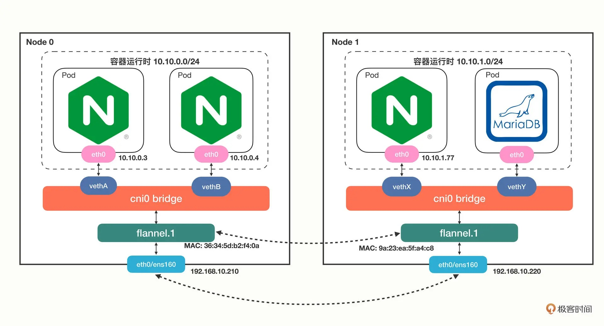
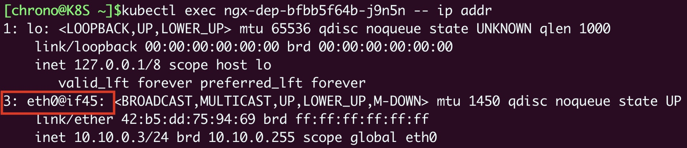
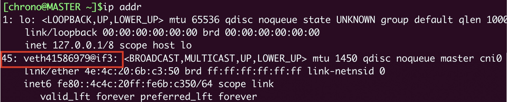
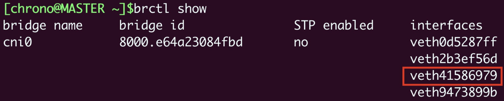
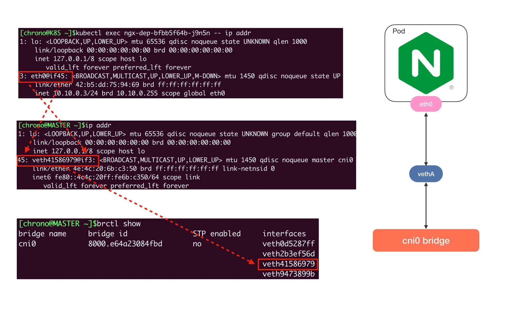
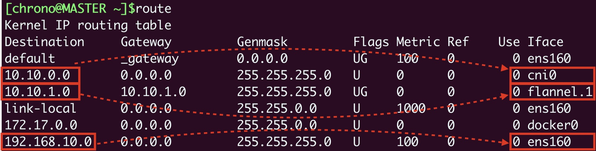
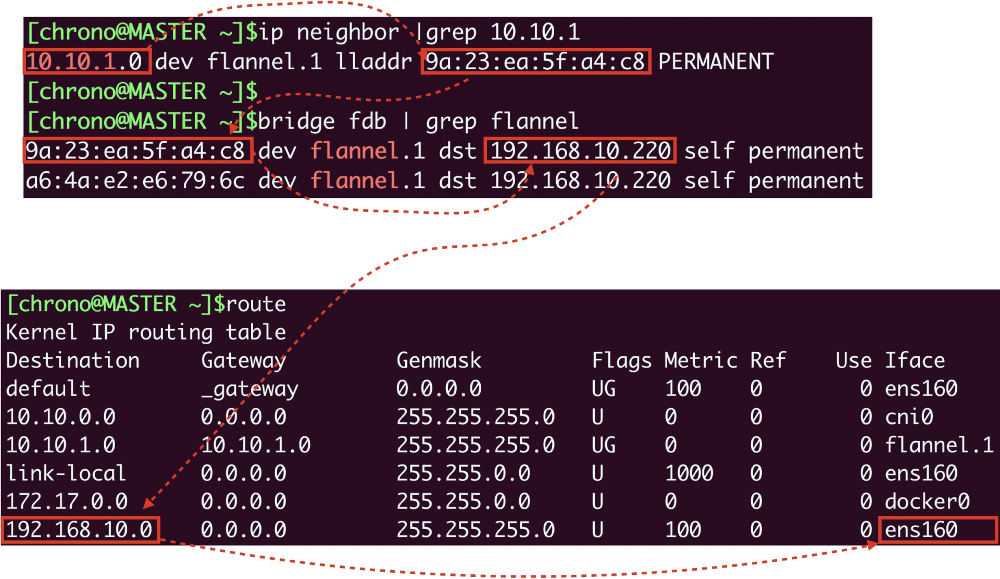
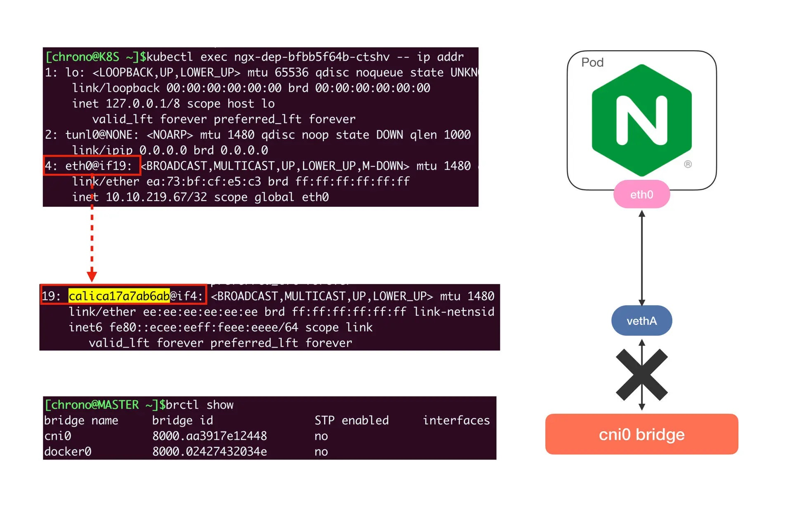
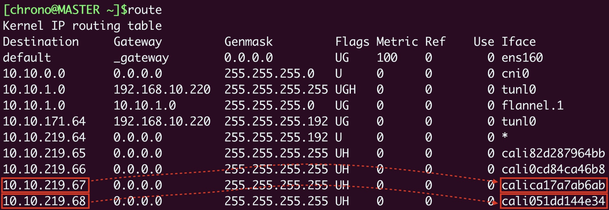
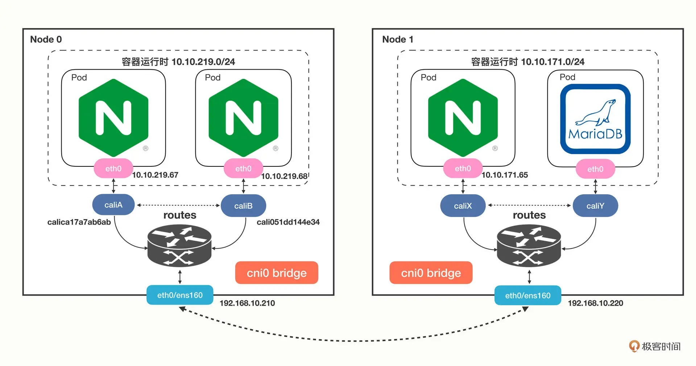

# 网络通信：CNI是怎么回事？又是怎么工作的？

## 什么是 CNI

​	Kubernetes 定义的这个网络模型很完美，但要把这个模型落地实现就不那么容易了。所以 Kubernetes 就专门制定了一个标准：**CNI**（Container Networking Interface）。

​	CNI 为网络插件定义了一系列通用接口，开发者只要遵循这个规范就可以接入 Kubernetes，为 Pod 创建虚拟网卡、分配 IP 地址、设置路由规则，最后就能够实现“IP-per-pod”网络模型。依据实现技术的不同，**CNI 插件可以大致上分成“Overlay”“Route”和“Underlay”三种。**

- Overlay 的原意是“覆盖”，是指它构建了一个工作在真实底层网络之上的“逻辑网络”，把原始的 Pod 网络数据封包，再通过下层网络发送出去，到了目的地再拆包。因为这个特点，它对底层网络的要求低，适应性强，缺点就是有额外的传输成本，性能较低。
- Route 也是在底层网络之上工作，但它没有封包和拆包，而是使用系统内置的路由功能来实现 Pod 跨主机通信。它的好处是性能高，不过对底层网络的依赖性比较强，如果底层不支持就没办法工作了。
- Underlay 就是直接用底层网络来实现 CNI，也就是说 Pod 和宿主机都在一个网络里，Pod 和宿主机是平等的。它对底层的硬件和网络的依赖性是最强的，因而不够灵活，但性能最高。

​	自从 2015 年 CNI 发布以来，由于它的接口定义宽松，有很大的自由发挥空间，所以社区里就涌现出了非常多的网络插件，我们之前提到的 Flannel 就是其中之一。

- Flannel（https://github.com/flannel-io/flannel/）由 CoreOS 公司（已被 Redhat 收购）开发，最早是一种 Overlay 模式的网络插件，使用 UDP 和 VXLAN 技术，后来又用 Host-Gateway 技术支持了 Route 模式。Flannel 简单易用，是 Kubernetes 里最流行的 CNI 插件，但它在性能方面表现不是太好，所以一般不建议在生产环境里使用。

​	现在还有两个常用 CNI 插件：Calico、Cilium，我们做个简略的介绍。

- Calico（https://github.com/projectcalico/calico）是一种 Route 模式的网络插件，使用 BGP 协议（Border Gateway Protocol）来维护路由信息，性能要比 Flannel 好，而且支持多种网络策略，具备数据加密、安全隔离、流量整形等功能。
- Cilium（https://github.com/cilium/cilium）是一个比较新的网络插件，同时支持 Overlay 模式和 Route 模式，它的特点是深度使用了 Linux eBPF 技术，在内核层次操作网络数据，所以性能很高，可以灵活实现各种功能。在 2021 年它加入了 CNCF，成为了孵化项目，是非常有前途的 CNI 插件。

## CNI 插件是怎么工作

​	Flannel 比较简单，我们先以它为例看看 CNI 在 Kubernetes 里的工作方式。这里必须要说明一点，计算机网络很复杂，有 IP 地址、MAC 地址、网段、网卡、网桥、路由等许许多多的概念，而且数据会流经多个设备，理清楚脉络比较麻烦，今天我们会做一个大概的描述，不会讲那些太底层的细节。我们先来在实验环境里用 Deployment 创建 3 个 Nginx Pod，作为研究对象：

```shell
$ kubectl create deploy ngx-dep --image=nginx:alpine --replicas=3
```

​	使用命令 `kubectl get pod` 可以看到，有两个 Pod 运行在 master 节点上，IP 地址分别是“10.10.0.3”“10.10.0.4”，另一个 Pod 运行在 worker 节点上，IP 地址是“10.10.1.77”。

​	Flannel 默认使用的是基于 VXLAN 的 Overlay 模式，整个集群的网络结构我画了一张示意图，你可以对比一下 Docker 的网络结构：



​	从单机的角度来看的话，Flannel 的网络结构和 Docker 几乎是一模一样的，只不过网桥换了“cni0”，而不是“docker0”。接下来我们来操作一下，看看 Pod 里的虚拟网卡是如何接入 cni0 网桥的。在 Pod 里执行命令 ip addr 就可以看到它里面的虚拟网卡“eth0”：



​	你需要注意它的形式，第一个数字“3”是序号，意思是第 3 号设备，“@if45”就是它另一端连接的虚拟网卡，序号是 45。因为这个 Pod 的宿主机是 master，我们就要登录到 master 节点，看看这个节点上的网络情况，同样还是用命令 ip addr：



​	这里就可以看到宿主机（master）节点上的第 45 号设备了，它的名字是 veth41586979@if3，“veth”表示它是一个虚拟网卡，而后面的“@if3”就是 Pod 里对应的 3 号设备，也就是“eth0”网卡了。

​	**那么“cni0”网桥的信息该怎么查看呢？这需要在宿主机（master）上使用命令 `brctl show`：**



​	从这张截图里，你可以发现“cni0”网桥上有 4 个虚拟网卡，第三个就是“veth41586979”，所以这个网卡就被“插”在了“cni0”网桥上，然后因为虚拟网卡的“结对”特性，Pod 也就连上了“cni0”网桥。单纯用 Linux 命令不太容易看清楚网卡和网桥的联系，所以我把它们整合在了下面的图里，加上了虚线标记，这样你就能更清晰地理解 Pod、veth 和 cni0 的引用关系了：



​	使用同样的方式，你可以知道另一个 Pod “10.10.0.4”的网卡是 veth2b3ef56d@if3，它也在“cni0”网桥上，所以借助这个网桥，本机的 Pod 就可以直接通信。弄清楚了本机网络，我们再来看跨主机的网络，它的关键是节点的路由表，用命令 route 查看：



​	它告诉我们有这些信息：

- 10.10.0.0/24 网段的数据，都要走 cni0 设备，也就是“cni0”网桥。
- 10.10.1.0/24 网段的数据，都要走 flannel.1 设备，也就是 Flannel。
- 192.168.10.0/24 网段的数据，都要走 ens160 设备，也就是我们宿主机的网卡。

​	假设我们要从 master 节点的“10.10.0.3”访问 worker 节点的“10.10.1.77”，因为 master 节点的“cni0”网桥管理的只是“10.10.0.0/24”这个网段，所以按照路由表，凡是“10.10.1.0/24”都要让 flannel.1 来处理，这样就进入了 Flannel 插件的工作流程。然后 Flannel 就要来决定应该如何把数据发到另一个节点，在各种表里去查询。因为这个过程比较枯燥，我就不详细说了，你可以参考下面的示意图，用到的命令有 `ip neighbor`、`bridge fdb` 等等：



​	Flannel 得到的结果就是要把数据发到“192.168.10.220”，也就是 worker 节点，所以它就会在原始网络包前面加上这些额外的信息，封装成 VXLAN 报文，用“ens160”网卡发出去，worker 节点收到后再拆包，执行类似的反向处理，就可以把数据交给真正的目标 Pod 了。

## 使用 Calico 网络插件

​	看到这里，是不是觉得 Flannel 的 Overlay 处理流程非常复杂，绕来绕去很容易让人头晕，那下面我们就来看看另一个 Route 模式的插件 Calico。你可以在 [Calico 的网站](https://www.tigera.io/project-calico/)上找到它的安装方式，我选择的是“本地自助安装（Self-managed on-premises）”，可以直接下载 YAML 文件：

```shell
$ wget https://projectcalico.docs.tigera.io/manifests/calico.yaml
```

​	Calico 的安装非常简单，只需要用 `kubectl apply` 就可以（记得安装之前最好把 Flannel 删除）：

```shell
$ kubectl apply -f calico.yaml
```

​	安装之后我们来查看一下 Calico 的运行状态，注意它也是在“kube-system”名字空间。

我们仍然创建 3 个 Nginx Pod 来做实验：

```shell
$ kubectl create deploy ngx-dep --image=nginx:alpine --replicas=3
```

​	我们会看到 master 节点上有两个 Pod，worker 节点上有一个 Pod，但它们的 IP 地址与刚才 Flannel 的明显不一样了，分别是 10.10.219.* 和 10.10.171.* ，这说明 Calico 的 IP 地址分配策略和 Flannel 是不同的。

​	然后我们来看看 Pod 里的网卡情况，你会发现虽然还是有虚拟网卡，但宿主机上的网卡名字变成了 calica17a7ab6ab@if4，而且并没有连接到“cni0”网桥上：



​	这是不是很奇怪？其实这是 Calico 的工作模式导致的正常现象。因为 Calico 不是 Overlay 模式，而是 Route 模式，所以它就没有用 Flannel 那一套，**而是在宿主机上创建路由规则，让数据包不经过网桥直接“跳”到目标网卡去**。来看一下节点上的路由表就能明白：



​	假设 Pod A“10.10.219.67”要访问 Pod B“10.10.219.68”，那么查路由表，知道走“cali051dd144e34”这个设备，而它恰好就在 Pod B 里，所以数据就会直接进 Pod B 的网卡，省去了网桥的中间步骤。Calico 的网络架构我也画了一张示意图，你可以再对比 Flannel 来学习：



​	至于在 Calico 里跨主机通信是如何路由的，你完全可以对照着路由表，一步步地“跳”到目标 Pod 去（提示：tunl0 设备）。

## 小结

​	好说了这么多，你应该看到了，Kubernetes 的整个网络数据传输过程有大量的细节，非常多的环节都参与其中，想把它彻底弄明白还真不是件容易的事情。不过好在 CNI 通过“依赖倒置”的原则把这些工作都交给插件去解决了，不管下层是什么样的环境，不管插件是怎么实现的，我们在 Kubernetes 集群里只会有一个干净、整洁的网络空间。我来简单小结一下今天的内容：

1. Kubernetes 使用的是“IP-per-pod”网络模型，每个 Pod 都会有唯一的 IP 地址，所以简单易管理。
2. CNI 是 Kubernetes 定义的网络插件接口标准，按照实现方式可以分成“Overlay”、“Route”和“Underlay”三种，常见的 CNI 插件有 Flannel、Calico 和 Cilium。
3. Flannel 支持 Overlay 模式，它使用了 cni0 网桥和 flannel.1 设备，本机通信直接走 cni0，跨主机通信会把原始数据包封装成 VXLAN 包再走宿主机网卡发送，有性能损失。
4. Calico 支持 Route 模式，它不使用 cni0 网桥，而是创建路由规则，把数据包直接发送到目标网卡，所以性能高。