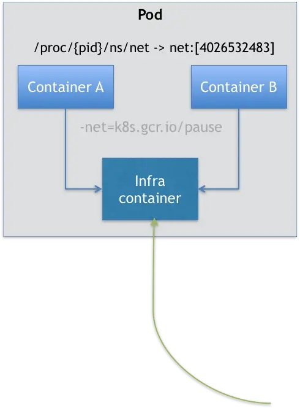
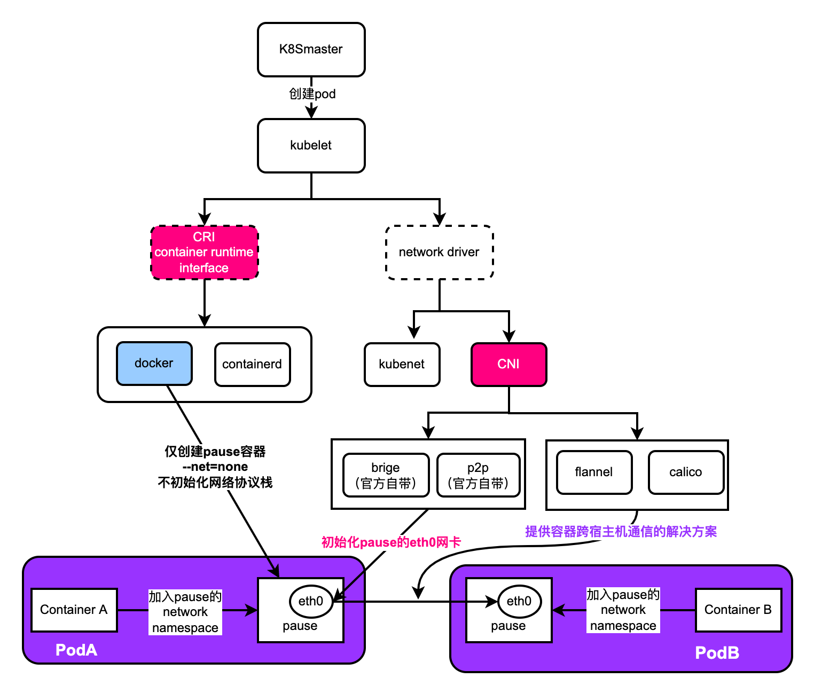
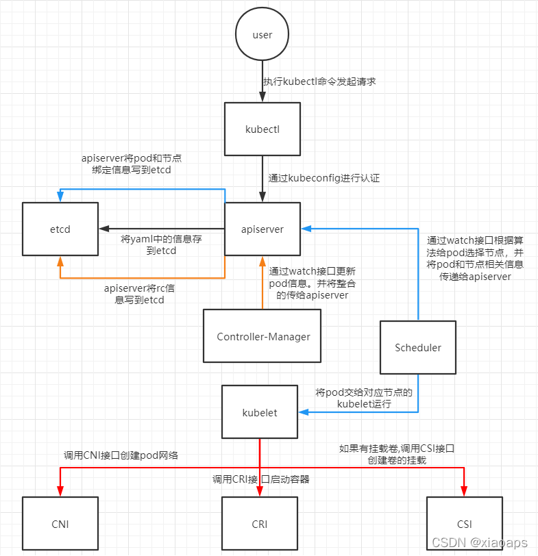

# 为什么我们需要Pod？

​	Kubernetes 项目里，Pod 是 Kubernetes 里的原子调度单位。这就意味着，Kubernetes 项目的调度器，是统一按照 Pod 而非容器的资源需求进行计算的。

​	不过，Pod 在 Kubernetes 项目里还有更重要的意义，**那就是：容器设计模式。**

## 一、Pod 的实现原理

​	**首先，关于 Pod 最重要的一个事实是：它只是一个逻辑概念。**

​	也就是说，Kubernetes 真正处理的，还是宿主机操作系统上 Linux 容器的 Namespace 和 Cgroups，而并不存在一个所谓的 Pod 的边界或者隔离环境。

​	那么，Pod 又是怎么被“创建”出来的呢？

​	答案是：Pod，其实是一组共享了某些资源的容器。

​	**具体的说：Pod 里的所有容器，共享的是同一个 Network Namespace，并且可以声明共享同一个 Volume。**

​	**那这么来看的话，一个有 A、B 两个容器的 Pod，不就是等同于一个容器（容器 A）共享另外一个容器（容器 B）的网络和 Volume 的玩儿法么？**

​	但是，你有没有考虑过，如果真这样做的话，容器 B 就必须比容器 A 先启动，这样一个 Pod 里的多个容器就不是对等关系，而是拓扑关系了。

​	所以，在 Kubernetes 项目里，Pod 的实现需要使用一个中间容器，这个容器叫作 Infra 容器。在这个 Pod 中，Infra 容器永远都是第一个被创建的容器，而其他用户定义的容器，则通过 Join Network Namespace 的方式，与 Infra 容器关联在一起。这样的组织关系，可以用下面这样一个示意图来表达：



​	如上图所示，这个 Pod 里有两个用户容器 A 和 B，还有一个 Infra 容器。很容易理解，在 Kubernetes 项目里，Infra 容器一定要占用极少的资源，所以它使用的是一个非常特殊的镜像，叫作：k8s.gcr.io/pause。这个镜像是一个用汇编语言编写的、永远处于“暂停”状态的容器，解压后的大小也只有 100~200 KB 左右。

​	而在 Infra 容器“Hold 住”Network Namespace 后，用户容器就可以加入到 Infra 容器的 Network Namespace 当中了。所以，如果你查看这些容器在宿主机上的 Namespace 文件（这个 Namespace 文件的路径，我已经在前面的内容中介绍过），它们指向的值一定是完全一样的。

​	这也就意味着，对于 Pod 里的容器 A 和容器 B 来说：

- 它们可以直接使用 localhost 进行通信；
- 它们看到的网络设备跟 Infra 容器看到的完全一样；
- 一个 Pod 只有一个 IP 地址，也就是这个 Pod 的 Network Namespace 对应的 IP 地址；
- 当然，其他的所有网络资源，都是一个 Pod 一份，并且被该 Pod 中的所有容器共享；
- Pod 的生命周期只跟 Infra 容器一致，而与容器 A 和 B 无关。

​	而对于同一个 Pod 里面的所有用户容器来说，它们的进出流量，也可以认为都是通过 Infra 容器完成的。

​	如下图是K8S创建Pod时，Pod的网络协议栈的初始化过程




​	简单解读，理解pause容器是k8s网络模型中的精髓～

1. kubelet通过CRI协议向底层的容器运行时（docker/containerd）下发命令，让它创建一个叫pause 的初始化容器，这个pause容器里运行着一个极简的C程序，具体的逻辑就是将自己阻塞中，目的是让pause容器快速占用并一直持有一个networkname。
2. 创建pause容器时，会携带参数`--net=node`意为不初始化网络协议栈，说白了就是除了自带的lo回环网卡外，不添加其他的网卡。
3. kubelet通过CNI协议为pause容器初始化网络协议，也就是给它添加网络并分配IP
4. Pod中定义的业务容器都加入pause容器的network namespace，它们都使用统一分配给pause的IP

​	**疑问：为什么pause容器的网络协议栈不由容器运行时创建它时立即分配好呢？**

​	答：这是个好问题，这么做也是呼应了k8s网络的核心目标思想：

1. IP分配，换句话说k8s要保证在整个集群中每个pod要独立不重复的IP地址。
2. IP路由，换句话说k8s要保证在整个集群中各个pod的IP是要互通的。

​	这也是它为什么设计这个流程的原因。

## 二、容器设计模式

​	Pod 这种“超亲密关系”容器的设计思想，实际上就是希望，当用户想在一个容器里跑多个功能并不相关的应用时，应该优先考虑它们是不是更应该被描述成一个 Pod 里的多个容器。

​	备注：容器间的紧密协作，我们可以称为“超亲密关系”。这些具有“超亲密关系”容器的典型特征包括但不限于：互相之间会发生直接的文件交换、使用 localhost 或者 Socket 文件进行本地通信、会发生非常频繁的远程调用、需要共享某些 Linux Namespace（比如，一个容器要加入另一个容器的 Network Namespace）等等。

### 第一个最典型的例子是：WAR 包与 Web 服务器。

```yaml
apiVersion: v1
kind: Pod
metadata:
  name: javaweb-2
spec:
  initContainers:
  - image: geektime/sample:v2
    name: war
    command: ["cp", "/sample.war", "/app"]
    volumeMounts:
    - mountPath: /app
      name: app-volume
  containers:
  - image: geektime/tomcat:7.0
    name: tomcat
    command: ["sh","-c","/root/apache-tomcat-7.0.42-v2/bin/start.sh"]
    volumeMounts:
    - mountPath: /root/apache-tomcat-7.0.42-v2/webapps
      name: app-volume
      ports:
    - containerPort: 8080
      hostPort: 8001 
  volumes:
  - name: app-volume
    emptyDir: {}
```

### 第二个例子，则是容器的日志收集

​	可以参考[cp4d-audit-webhook](https://github.com/Youngpig1998/cp4d-audit-webhook)项目	

​	上述两个例子都是sidecar模式的经典应用

## 三、总结

​	Pod 是 Kubernetes 项目与其他单容器项目相比最大的不同，也是一位容器技术初学者需要面对的第一个与常规认知不一致的知识点。

​	事实上，直到现在，仍有很多人把容器跟虚拟机相提并论，他们把容器当做性能更好的虚拟机，喜欢讨论如何把应用从虚拟机无缝地迁移到容器中。

​	但实际上，无论是从具体的实现原理，还是从使用方法、特性、功能等方面，容器与虚拟机几乎没有任何相似的地方；也不存在一种普遍的方法，能够把虚拟机里的应用无缝迁移到容器中。因为，容器的性能优势，必然伴随着相应缺陷，即：它不能像虚拟机那样，完全模拟本地物理机环境中的部署方法。

​	所以，这个“上云”工作的完成，最终还是要靠深入理解容器的本质，即：进程。

​	实际上，一个运行在虚拟机里的应用，哪怕再简单，也是被管理在 systemd 或者 supervisord 之下的一组进程，而不是一个进程。这跟本地物理机上应用的运行方式其实是一样的。这也是为什么，从物理机到虚拟机之间的应用迁移，往往并不困难。

​	可是对于容器来说，一个容器永远只能管理一个进程。更确切地说，一个容器，就是一个进程。这是容器技术的“天性”，不可能被修改。所以，将一个原本运行在虚拟机里的应用，“无缝迁移”到容器中的想法，实际上跟容器的本质是相悖的。

​	这也是当初 Swarm 项目无法成长起来的重要原因之一：一旦到了真正的生产环境上，Swarm 这种单容器的工作方式，就难以描述真实世界里复杂的应用架构了。

​	所以，你现在可以这么理解 Pod 的本质：**Pod，实际上是在扮演传统基础设施里“虚拟机”的角色；而容器，则是这个虚拟机里运行的用户程序。**

​	所以下一次，当你需要把一个运行在虚拟机里的应用迁移到 Docker 容器中时，一定要仔细分析到底有哪些进程（组件）运行在这个虚拟机里。

​	然后，你就可以把整个虚拟机想象成为一个 Pod，把这些进程分别做成容器镜像，把有顺序关系的容器，定义为 Init Container。这才是更加合理的、松耦合的容器编排诀窍，也是从传统应用架构，到“微服务架构”最自然的过渡方式。

​	注意：Pod 这个概念，提供的是一种编排思想，而不是具体的技术方案。所以，如果愿意的话，你完全可以使用虚拟机来作为 Pod 的实现，然后把用户容器都运行在这个虚拟机里。比如，Mirantis 公司的virtlet 项目就在干这个事情。甚至，你可以去实现一个带有 Init 进程的容器项目，来模拟传统应用的运行方式。


## 四、思考题

1. 除了 Network Namespace 外，Pod 里的容器还可以共享哪些 Namespace 呢？你能说出共享这些 Namesapce 的具体应用场景吗？

   kubernetes编排和调度的基本单元是一个个的pod，其中每个pod中会包含一个或者多个容器，例如，如下的配置定义了一个pod，包含有两个container：

```yaml
apiVersion: v1
kind: Pod
metadata:
  name: nginx
spec:
  shareProcessNamespace: true
  containers:
  - name: nginx
    image: nginx
  - name: shell
    image: busybox
    stdin: true
    tty: true
```

​	调度到kubernetes平台之后，会发现有两个容器在运行：


​	这里要强调的是同一个pod中的各容器是共享一些资源的，其实就是namespace是打通的，比如pid namespace、network namespace以及存储的namespace等。

​	共享pid namespace，也就是说你在一个容器中能看到另外一个容器的进程列表。

​	pod级别的共享控制参数：ShareProcessNamespace 默认是开启的，

​	可以通过禁用：

```
--feature-gates=PodShareProcessNamespace=false
```

​	比如，可以尝试在busybox容器中运行ps，可以看到nginx相关的进程。

​	命名空间的共享在底层是通过docker来支持的。同样的，也有控制网络命名空间相关的配置。为了确认这一点，docker insepect相关的容器


​	可以看到，两个容器的命名空间是共享的。

 

最后，一个pod中的容器可以共享的资源有：

- PID命名空间：Pod中的不同应用程序可以看到其他应用程序的进程ID；
- 网络命名空间：Pod中的多个容器能够访问同一个IP和端口范围；
- IPC命名空间：Pod中的多个容器能够使用SystemV IPC或POSIX消息队列进行通信；
- UTS命名空间：Pod中的多个容器共享一个主机名；
- Volumes（共享存储卷）：Pod中的各个容器可以访问在Pod级别定义的Volumes；

2. k8s中一个pod的创建流程？



1. 用户通过kubectl命名发起请求。
2. apiserver通过对应的kubeconfig进行认证，认证通过后将yaml中的po信息存到etcd。
3. Controller-Manager通过apiserver的watch接口发现了pod信息的更新，执行该资源所依赖的拓扑结构整合，整合后将对应的信息交给apiserver，apiserver写到etcd，此时pod已经可以被调度。
4. Scheduler同样通过apiserver的watch接口更新到pod可以被调度，通过算法给pod分配节点，并将pod和对应节点绑定的信息交给apiserver，apiserver写到etcd，然后将pod交给kubelet。
5. kubelet收到pod后，调用CNI接口给pod创建pod网络，调用CRI接口去启动容器，调用CSI进行存储卷的挂载。网络，容器，存储创建完成后pod创建完成，等业务进程启动后，pod运行成功。