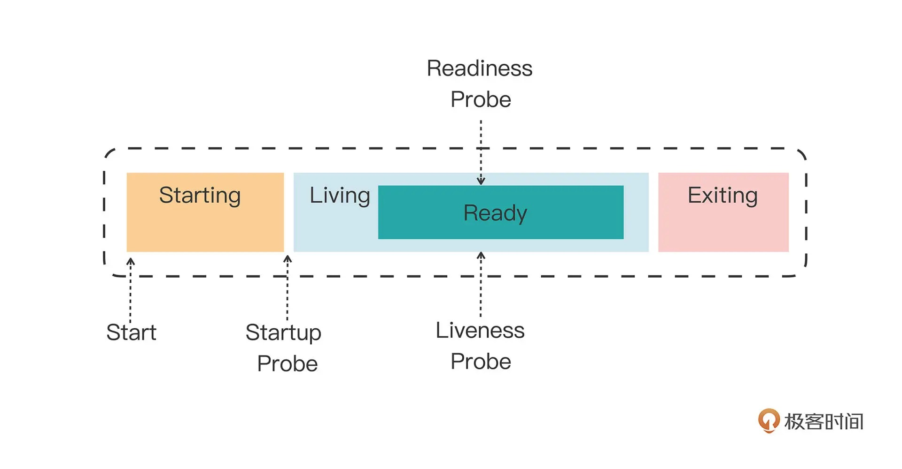
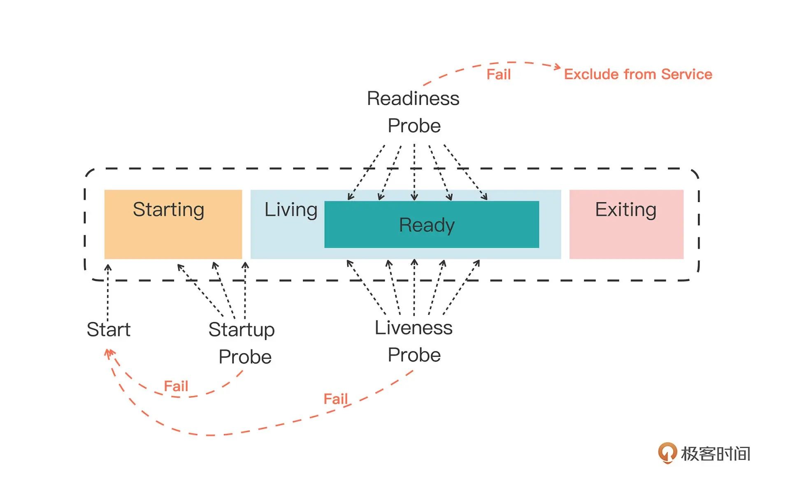
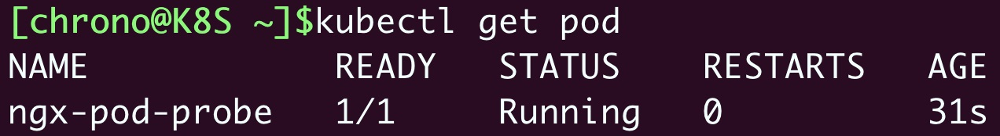
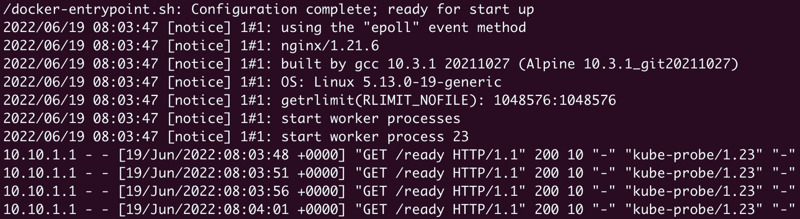
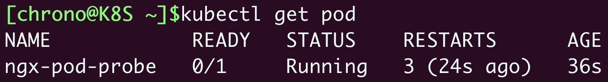

# 深入解析Pod对象

## 一、Lifecycle字段

​	它定义的是 Container Lifecycle Hooks。顾名思义，Container Lifecycle Hooks 的作用，是在容器状态发生变化时触发一系列“钩子”。我们来看这样一个例子：

```yaml
apiVersion: v1
kind: Pod
metadata:
  name: lifecycle-demo
spec:
  containers:

  - name: lifecycle-demo-container
    image: nginx
    lifecycle:
      postStart:
        exec:
          command: ["/bin/sh", "-c", "echo Hello from the postStart handler > /usr/share/message"]
      preStop:
        exec:
          command: ["/usr/sbin/nginx","-s","quit"]
```

​	这是一个来自 Kubernetes 官方文档的 Pod 的 YAML 文件。它其实非常简单，只是定义了一个 nginx 镜像的容器。不过，在这个 YAML 文件的容器（Containers）部分，你会看到这个容器分别设置了一个 postStart 和 preStop 参数。这是什么意思呢？

​	先说 postStart 吧。它指的是，在容器启动后，立刻执行一个指定的操作。需要明确的是，postStart 定义的操作，虽然是在 Docker 容器 ENTRYPOINT 执行之后，但它并不严格保证顺序。**也就是说，在 postStart 启动时，ENTRYPOINT 有可能还没有结束。**

​	当然，如果 postStart 执行超时或者错误，Kubernetes 会在该 Pod 的 Events 中报出该容器启动失败的错误信息，导致 Pod 也处于失败的状态。

​	而类似地，preStop 发生的时机，则是容器被杀死之前（比如，收到了 SIGKILL 信号）。而需要明确的是，preStop 操作的执行，是同步的。所以，它会阻塞当前的容器杀死流程，直到这个 Hook 定义操作完成之后，才允许容器被杀死，这跟 postStart 不一样。

​	所以，在这个例子中，我们在容器成功启动之后，在 /usr/share/message 里写入了一句“欢迎信息”（即 postStart 定义的操作）。**而在这个容器被删除之前，我们则先调用了 nginx 的退出指令（即 preStop 定义的操作），从而实现了容器的“优雅退出”**。

## 二、Projected Volume

​	在 Kubernetes 中，有几种特殊的 Volume，它们存在的意义不是为了存放容器里的数据，也不是用来进行容器和宿主机之间的数据交换。这些特殊 Volume 的作用，是为容器提供预先定义好的数据。所以，从容器的角度来看，这些 Volume 里的信息就是仿佛是被 Kubernetes“投射”（Project）进入容器当中的。这正是 Projected Volume 的含义。

到目前为止，Kubernetes 支持的 Projected Volume 一共有四种：

1、Secret；

2、ConfigMap；

3、Downward API；

4、ServiceAccountToken   它其实是一种特殊的secret资源，用于保存 Service Account 的授权信息和文件

​	在今天这篇文章中，我首先和你分享的是 Secret。它的作用，是帮你把 Pod 想要访问的加密数据，存放到 Etcd 中。然后，你就可以通过在 Pod 的容器里挂载 Volume 的方式，访问到这些 Secret 里保存的信息了。

​	Secret 最典型的使用场景，莫过于存放数据库的 Credential 信息，比如下面这个例子：

```yaml
apiVersion: v1
kind: Pod
metadata:
  name: test-projected-volume 
spec:
  containers:
  - name: test-secret-volume
    image: busybox
    args:
    - sleep
    - "86400"
    volumeMounts:
    - name: mysql-cred
      mountPath: "/projected-volume"
      readOnly: true
  volumes:
  - name: mysql-cred
    projected:
      sources:
      - secret:
          name: user
      - secret:
          name: pass
```

​	在这个 Pod 中，我定义了一个简单的容器。它声明挂载的 Volume，并不是常见的 emptyDir 或者 hostPath 类型，而是 projected 类型。而这个 Volume 的数据来源（sources），则是名为 user 和 pass 的 Secret 对象，分别对应的是数据库的用户名和密码。

​	这里用到的数据库的用户名、密码，正是以 Secret 对象的方式交给 Kubernetes 保存的。完成这个操作的指令，如下所示：

```shell
$ cat ./username.txt
admin
$ cat ./password.txt
c1oudc0w!

$ kubectl create secret generic user --from-file=./username.txt
$ kubectl create secret generic pass --from-file=./password.txt
```

​	其中，username.txt 和 password.txt 文件里，存放的就是用户名和密码；而 user 和 pass，则是我为 Secret 对象指定的名字。而我想要查看这些 Secret 对象的话，只要执行一条 kubectl get 命令就可以了：

```shell
$ kubectl get secrets
NAME           TYPE                                DATA      AGE
user          Opaque                                1         51s
pass          Opaque                                1         51s
```

​	当然，除了使用 kubectl create secret 指令外，我也可以直接通过编写 YAML 文件的方式来创建这个 Secret 对象，比如：

```yaml
apiVersion: v1
kind: Secret
metadata:
  name: mysecret
type: Opaque
data:
  user: YWRtaW4=
  pass: MWYyZDFlMmU2N2Rm
```

​	可以看到，通过编写 YAML 文件创建出来的 Secret 对象只有一个。但它的 data 字段，却以 Key-Value 的格式保存了两份 Secret 数据。其中，“user”就是第一份数据的 Key，“pass”是第二份数据的 Key。

​	需要注意的是，通过yaml文件创建的Secret 对象要求里面的数据必须是经过 Base64 转码的，以免出现明文密码的安全隐患。这个转码操作也很简单，比如：

```shell
$ echo -n 'admin' | base64
YWRtaW4=
$ echo -n '1f2d1e2e67df' | base64
MWYyZDFlMmU2N2Rm
```

​	而且，像这样创建的 Secret 对象，它里面的内容仅仅是经过了转码，而并没有被加密。在真正的生产环境中，**你需要在 Kubernetes 中开启 Secret 的加密插件，增强数据的安全性**。关于开启 Secret 加密插件的内容，我会在后续专门讲解 Secret 的时候，再做进一步说明。

​	更重要的是，像这样通过挂载方式进入到容器里的 Secret，一旦其对应的 Etcd 里的数据被更新，这些 Volume 里的文件内容，同样也会被更新。其实，这是 kubelet 组件在定时维护这些 Volume。需要注意的是，这个更新可能会有一定的延时。**所以在编写应用程序时，在发起数据库连接的代码处写好重试和超时的逻辑，绝对是个好习惯。**

​	对于Downward API ，它能够获取到的信息，一定是 Pod 里的容器进程启动之前就能够确定下来的信息，如使用fieldRef可以声明使用:spec.nodeName - 宿主机名字、status.hostIP - 宿主机IP、metadata.name - Pod的名字、metadata.namespace - Pod的Namespace、status.podIP - Pod的IP、spec.serviceAccountName - Pod的Service Account的名字。而如果你想要获取 Pod 容器运行后才会出现的信息，比如，容器进程的 PID，那就肯定不能使用 Downward API 了，而应该考虑在 Pod 里定义一个 sidecar 容器。

​	其实，Secret、ConfigMap，以及 Downward API 这三种 Projected Volume 定义的信息，大多还可以通过环境变量的方式出现在容器里。但是，通过环境变量获取这些信息的方式，不具备自动更新的能力。所以，一般情况下，我都建议你使用 Volume 文件的方式获取这些信息。

## 三、健康检查

​	Kubernetes 中并没有 Docker 的 Stop 语义。所以虽然是 Restart（重启），但实际却是重新创建了容器。

​	这个功能就是 Kubernetes 里的 Pod 恢复机制，也叫 restartPolicy。它是 Pod 的 Spec 部分的一个标准字段（pod.spec.restartPolicy），默认值是 Always，即：任何时候这个容器发生了异常，它一定会被重新创建。

​	这里要强调一下，如果是以Pod的Kind形式创建了的Pod，这个Pod在restart恢复过程，永远都是发生在当前节点上，而不会跑到别的节点上去。事实上，一旦一个 Pod 与一个节点（Node）绑定，除非这个绑定发生了变化（pod.spec.node 字段被修改），否则它永远都不会离开这个节点。这也就意味着，如果这个宿主机宕机了，这个 Pod 也不会主动迁移到其他节点上去。

​	而如果你想让 Pod 出现在其他的可用节点上，就必须使用 Deployment 这样的“控制器”来管理 Pod，哪怕你只需要一个 Pod 副本。作为用户，你还可以通过设置 restartPolicy，改变 Pod 的恢复策略。除了 Always，它还有 OnFailure 和 Never 两种情况。在实际使用时，我们需要根据应用运行的特性，合理设置这三种恢复策略。在这里只要记住如下两个基本的设计原理即可：

- 只要 Pod 的 restartPolicy 指定的策略允许重启异常的容器（比如：Always），那么这个 Pod 就会保持 Running 状态，并进行容器重启。否则，Pod 就会进入 Failed 状态 。

- 对于包含多个容器的 Pod，只有它里面所有的容器都进入异常状态后，Pod 才会进入 Failed 状态。在此之前，Pod 都是 Running 状态。此时，Pod 的 READY 字段会显示正常容器的个数，比如：

  ```shell
  $ kubectl get pod test-liveness-exec
  NAME           READY     STATUS    RESTARTS   AGE
  liveness-exec   0/1       Running   1          1m
  ```

  所以，假如一个 Pod 里只有一个容器，然后这个容器异常退出了。那么，只有当 restartPolicy=Never 时，这个 Pod 才会进入 Failed 状态。而其他情况下，由于 Kubernetes 都可以重启这个容器，所以 Pod 的状态保持 Running 不变。而如果这个 Pod 有多个容器，仅有一个容器异常退出，它就始终保持 Running 状态，哪怕即使 restartPolicy=Never。只有当所有容器也异常退出之后，这个 Pod 才会进入 Failed 状态。其他情况，都可以以此类推出来。

​	除了在容器中执行命令外，livenessProbe 也可以定义为发起 HTTP 或者 TCP 请求的方式，定义格式如下：

```yaml
...
livenessProbe:
     httpGet:
       path: /healthz
       port: 8080
       httpHeaders:
       - name: X-Custom-Header
         value: Awesome
       initialDelaySeconds: 3
       periodSeconds: 3
```

```yaml
    ...
livenessProbe:
  tcpSocket:
    port: 8080
  initialDelaySeconds: 15
  periodSeconds: 20
```

​	所以，你的 Pod 其实可以暴露一个健康检查 URL（比如 /healthz），或者直接让健康检查去检测应用的监听端口。这两种配置方法，在 Web 服务类的应用中非常常用。

​	**在 Kubernetes 的 Pod 中，还有一个叫 readinessProbe 的字段。虽然它的用法与 livenessProbe 类似，但作用却大不一样。readinessProbe 检查结果的成功与否，决定的这个 Pod 是不是能被通过 Service 的方式访问到，而并不影响 Pod 的生命周期。这部分内容，我会在讲解 Service 时重点介绍。**

------

​	Kubernetes 为检查应用状态定义了三种探针，它们分别对应容器不同的状态：

- Startup，启动探针，**用来检查应用是否已经启动成功**，适合那些有大量初始化工作要做，启动很慢的应用。
- Liveness，存活探针，**用来检查应用是否正常运行**，是否存在死锁、死循环。
- Readiness，就绪探针，**用来检查应用是否可以接收流量**，是否能够对外提供服务。

​	你需要注意这三种探针是递进的关系：应用程序先启动，加载完配置文件等基本的初始化数据就进入了 Startup 状态，之后如果没有什么异常就是 Liveness 存活状态，但可能有一些准备工作没有完成，还不一定能对外提供服务，只有到最后的 Readiness 状态才是一个容器最健康可用的状态。初次接触这三种状态可能有点难理解，我画了一张图，你可以看一下状态与探针的对应关系：



​	那 Kubernetes 具体是如何使用状态和探针来管理容器的呢？**如果一个 Pod 里的容器配置了探针，Kubernetes 在启动容器后就会不断地调用探针来检查容器的状态**：

- 如果 Startup 探针失败，Kubernetes 会认为容器没有正常启动，就会尝试反复重启，当然其后面的 Liveness 探针和 Readiness 探针也不会启动。
- 如果 Liveness 探针失败，Kubernetes 就会认为容器发生了异常，也会重启容器。
- 如果 Readiness 探针失败，Kubernetes 会认为容器虽然在运行，但内部有错误，不能正常提供服务，就会把容器从 Service 对象的负载均衡集合中排除，不会给它分配流量。

​	知道了 Kubernetes 对这三种状态的处理方式，我们就可以在开发应用的时候编写适当的检查机制，让 Kubernetes 用“探针”定时为应用做“体检”了。在刚才图的基础上，我又补充了 Kubernetes 的处理动作，看这张图你就能很好地理解容器探针的工作流程了：



### 如何使用容器状态探针

​	掌握了资源配额和检查探针的概念，我们进入今天的高潮部分，看看如何在 Pod 的 YAML 描述文件里定义探针。startupProbe、livenessProbe、readinessProbe 这三种探针的配置方式都是一样的，关键字段有这么几个：

- periodSeconds，执行探测动作的时间间隔，默认是 10 秒探测一次。
- timeoutSeconds，探测动作的超时时间，如果超时就认为探测失败，默认是 1 秒。
- successThreshold，连续几次探测成功才认为是正常，对于 startupProbe 和 livenessProbe 来说它只能是 1。
- failureThreshold，连续探测失败几次才认为是真正发生了异常，默认是 3 次。

​	至于探测方式，Kubernetes 支持 3 种：Shell、TCP Socket、HTTP GET，它们也需要在探针里配置：

- exec，执行一个 Linux 命令，比如 ps、cat 等等，和 container 的 command 字段很类似。
- tcpSocket，使用 TCP 协议尝试连接容器的指定端口。
- httpGet，连接端口并发送 HTTP GET 请求。

​	要使用这些探针，我们必须要在开发应用时预留出“检查口”，这样 Kubernetes 才能调用探针获取信息。这里我还是以 Nginx 作为示例，用 ConfigMap 编写一个配置文件：

```yaml
apiVersion: v1
kind: ConfigMap
metadata:
  name: ngx-conf

data:
  default.conf: |
    server {
      listen 80;
      location = /ready {
        return 200 'I am ready';
      }
    }
```

​	你可能不是太熟悉 Nginx 的配置语法，我简单解释一下。在这个配置文件里，我们启用了 80 端口，然后用 location 指令定义了 HTTP 路径 /ready，它作为对外暴露的“检查口”，用来检测就绪状态，返回简单的 200 状态码和一个字符串表示工作正常。现在我们来看一下 Pod 里三种探针的具体定义：

```yaml
apiVersion: v1
kind: Pod
metadata:
  name: ngx-pod-probe

spec:
  volumes:
  - name: ngx-conf-vol
    configMap:
      name: ngx-conf

  containers:
  - image: nginx:alpine
    name: ngx
    ports:
    - containerPort: 80
    volumeMounts:
    - mountPath: /etc/nginx/conf.d
      name: ngx-conf-vol

    startupProbe:
      periodSeconds: 1
      exec:
        command: ["cat", "/var/run/nginx.pid"]

    livenessProbe:
      periodSeconds: 10
      tcpSocket:
        port: 80

    readinessProbe:
      periodSeconds: 5
      httpGet:
        path: /ready
        port: 80
```

​	StartupProbe 使用了 Shell 方式，使用 `cat` 命令检查 Nginx 存在磁盘上的进程号文件（/var/run/nginx.pid），如果存在就认为是启动成功，它的执行频率是每秒探测一次。LivenessProbe 使用了 TCP Socket 方式，尝试连接 Nginx 的 80 端口，每 10 秒探测一次。ReadinessProbe 使用的是 HTTP GET 方式，访问容器的 /ready 路径，每 5 秒发一次请求。现在我们用 kubectl apply 创建这个 Pod，然后查看它的状态：



​	当然，因为这个 Nginx 应用非常简单，它启动后探针的检查都会是正常的，你可以用 kubectl logs 来查看 Nginx 的访问日志，里面会记录 HTTP GET 探针的执行情况：



​	从截图中你可以看到，Kubernetes 正是以大约 5 秒一次的频率，向 URI /ready 发送 HTTP 请求，不断地检查容器是否处于就绪状态。为了验证另两个探针的工作情况，我们可以修改探针，比如把命令改成检查错误的文件、错误的端口号：

```yaml
startupProbe:
  exec:
    command: ["cat", "nginx.pid"]  #错误的文件

livenessProbe:
  tcpSocket:
    port: 8080                     #错误的端口号
```

​	然后我们重新创建 Pod 对象，观察它的状态。当 StartupProbe 探测失败的时候，Kubernetes 就会不停地重启容器，现象就是 RESTARTS 次数不停地增加，而 livenessProbe 和 readinessProbePod 没有执行，Pod 虽然是 Running 状态，也永远不会 READY：



​	因为 failureThreshold 的次数默认是三次，所以 Kubernetes 会连续执行三次 livenessProbe TCP Socket 探测，每次间隔 10 秒，30 秒之后都失败才重启容器：


## 四、思考题

​	1、Pod通过健康检查是指里面所有的Container都通过吗?

​		都通过

​	2、你能否说出，Kubernetes 使用的这个“控制器模式”，跟我们平常所说的“事件驱动”，有什么区别和联系吗？

​		事件驱动是被动的：被控制对象要自己去判断是否需要被编排，调度。实时将事件通知给控制器。 控制器模式是主动的：被控制对象只需要实时同步自己的状态(实际由kubelet做的)，具体的判断逻辑由控制去做。		

​		除了上面提到的主动与被动区别，事件往往是一次性的，如果操作失败比较难处理，但是控制器是循环一直在尝试的，更符合kubernetes申明式API，最终达到与申明一致。

​	3、你能否举出一些 Pod（即容器）的状态是 Running，但是应用其实已经停止服务的例子？相信 Java Web 开发者的亲身体会会比较多吧。

​	4、在没有 Kubernetes 的时候，你是通过什么方法进行应用的健康检查的？Kubernetes 的 livenessProbe 和 readinessProbe 提供的几种探测机制，是否能满足你的需求？

​		Dockerfile中的HEALTHCHECK关键字。